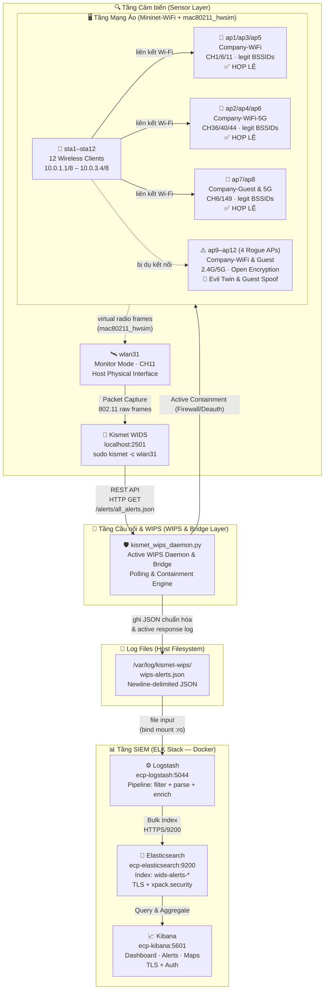
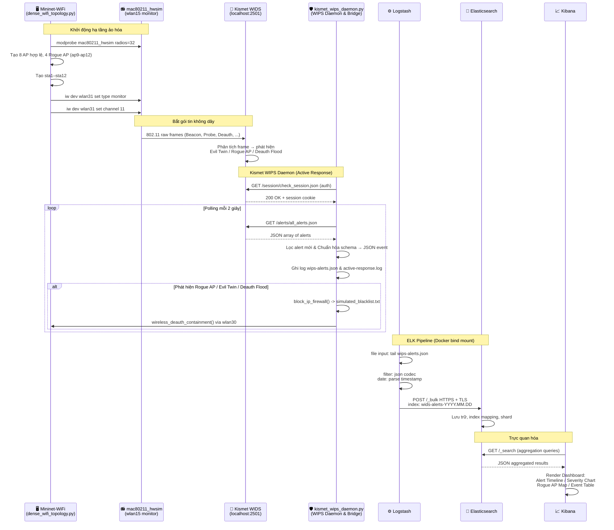
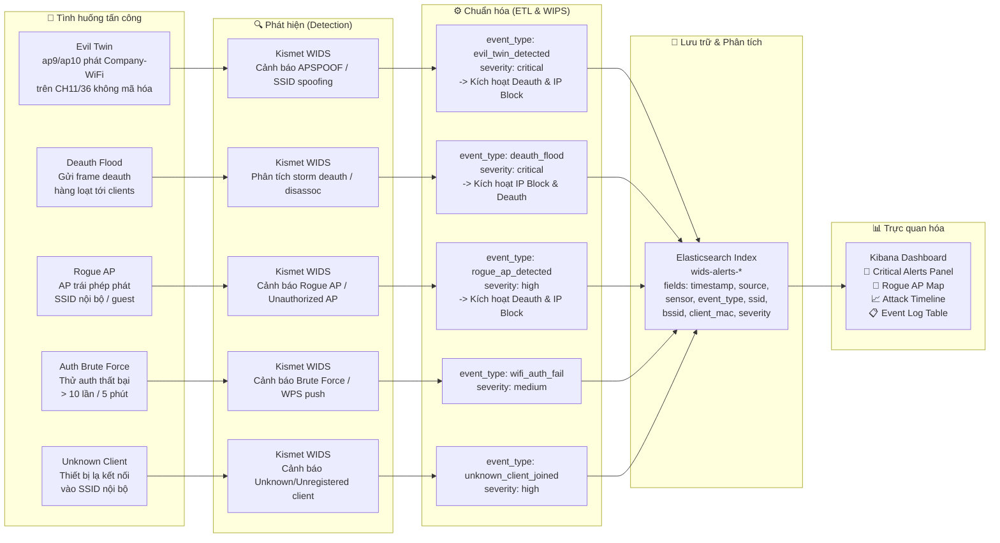
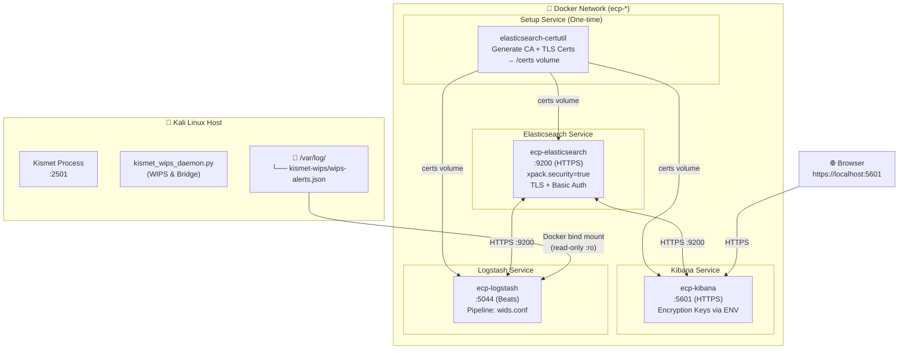
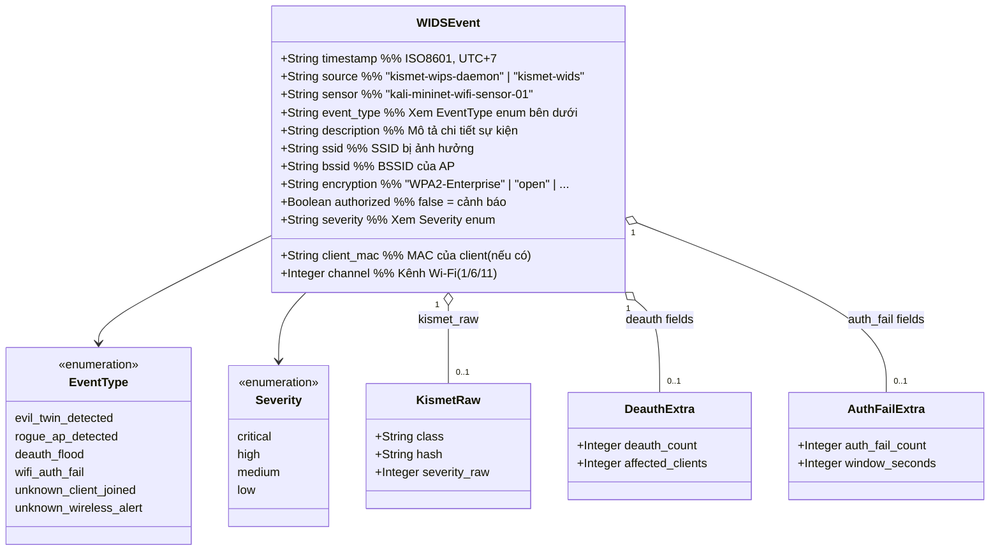
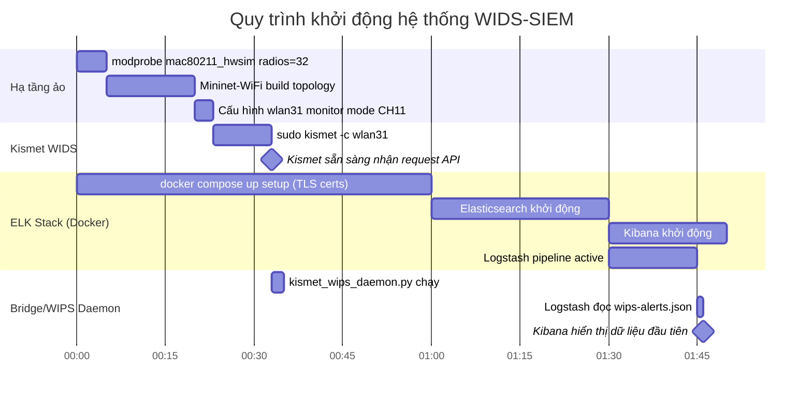

# 🛡️ Data Flow — Wireless Network Security WIDS-SIEM

> **Dự án:** Wireless/Mobile Network Security — WIDS tích hợp ELK Stack  
> **Stack:** Mininet-WiFi · Kismet · Python Scripts · Logstash · Elasticsearch · Kibana  
> **Mục tiêu:** Phát hiện, thu thập và trực quan hóa các mối đe dọa Wi-Fi (Rogue AP, Evil Twin, Deauth Flood, v.v.)

---

## 1. Tổng quan kiến trúc hệ thống

---

## 2. Chi tiết luồng dữ liệu từ nguồn đến đích

---

## 3. Luồng xử lý sự kiện tấn công (Attack Event Flow)

---

## 4. Kiến trúc Docker và kết nối dịch vụ

---

## 5. Schema sự kiện JSON chuẩn (Event Schema)

---

## 6. Timeline khởi động hệ thống

---

## 7. Bảng tóm tắt thành phần

| Thành phần | Loại | Địa chỉ / Đường dẫn | Vai trò |
|---|---|---|---|
| `dense_wifi_topology.py` | Python Script | `src/` | Tạo mạng Wi-Fi ảo với 8 AP hợp lệ + 4 Rogue AP |
| `mac80211_hwsim` | Kernel Module | `wlan0`–`wlan32` | Cung cấp 32 card Wi-Fi ảo |
| `wlan31` | Monitor Interface | CH11 | Bắt mọi frame 802.11 cho Kismet |
| **Kismet WIDS** | Daemon | `localhost:2501` | Phân tích frame → sinh alert APSPOOF/Deauth/v.v. |
| `kismet_wips_daemon.py` | Active WIPS Daemon & Bridge | `src/` | Daemon kết nối API Kismet, chuẩn hóa log và cô lập Rogue AP (IP block & Deauth) |
| **Logstash** | Docker Container | `ecp-logstash:5044` | Parse + enrich + forward → Elasticsearch |
| **Elasticsearch** | Docker Container | `ecp-elasticsearch:9200` | Lưu trữ + index WIDS events |
| **Kibana** | Docker Container | `ecp-kibana:5601` | Dashboard trực quan hóa cảnh báo |
| `/var/log/kismet-wips/` | Log Dir | Host FS | File trung gian giữa Scripts và Logstash |
| TLS Certificates | PKI Volume | Docker `certs` volume | Bảo mật toàn bộ kênh truyền ELK |

---

## 8. Luồng dữ liệu bảo mật (Security Data Path)

```mermaid
flowchart LR
    subgraph UNTRUSTED["🔴 Vùng không tin cậy"]
        ROGUE2["Rogue AP\nEvil Twin\nDeauth Attacker"]
    end

    subgraph DETECTION["🟡 Vùng phát hiện & Phản ứng"]
        AIR["📻 Không gian vô tuyến\n(802.11 frames)"]
        KS2["Kismet\nReal-time WIDS\nDetection Engine"]
        WIPS["Kismet WIPS\nDaemon Engine"]
    end

    subgraph PROCESSING["🟠 Vùng xử lý"]
        PIPE["Logstash Pipeline\nParse → Enrich → Normalize\nGeo-IP · Severity mapping · Timestamp fix"]
    end

    subgraph STORAGE["🟢 Vùng lưu trữ & phân tích"]
        IDX["Elasticsearch\nTime-series Index\nFull-text Search"]
        DASH["Kibana\nReal-time Dashboard\nAlert Rules · SIEM Views"]
    end

    ROGUE2 -->|"Beacon / Probe / Deauth\n802.11 frames"| AIR
    AIR -->|"Captured by wlan31\nMonitor Mode"| KS2
    KS2 -->|"REST API\nalerts JSON"| WIPS
    WIPS -->|"Normalized JSON Events\n/var/log/kismet-wips/wips-alerts.json"| PIPE
    PIPE -->|"HTTPS + TLS\nBulk Index"| IDX
    IDX -->|"Aggregated Results"| DASH

    style UNTRUSTED fill:#ff4444,color:#fff
    style DETECTION fill:#ff9900,color:#000
    style PROCESSING fill:#ffcc00,color:#000
    style STORAGE fill:#00aa44,color:#fff
```

---

*Tài liệu được tạo tự động theo kiến trúc thực tế của dự án.*  
*Cập nhật lần cuối: 2026-05-18*
