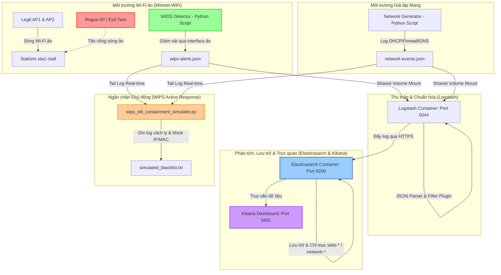

# 🛡️ Hệ Thống Mô Phỏng WIDS/WIPS Tích Hợp SIEM ELK Stack Trong Môi Trường Mạng Không Dây Mật Độ Cao

Dự án này tập trung vào việc **thiết kế, mô phỏng và triển khai một giải pháp phát hiện/ngăn chặn xâm nhập không dây (WIDS/WIPS)**, sau đó tích hợp và chuẩn hóa dữ liệu cảnh báo thời gian thực vào hạ tầng **SIEM ELK Stack** (Elasticsearch, Logstash, Kibana) nhằm thực hiện tương quan sự kiện an ninh liên miền mạng (Wireless + LAN).

Hệ thống được thiết kế chạy **hoàn toàn trên máy ảo hoặc máy host Kali Linux**, tận dụng tối đa công nghệ ảo hóa sóng vô tuyến ảo để mô phỏng một môi trường Wi-Fi doanh nghiệp thực tế mà không cần trang bị phần cứng Router/AP vật lý đắt đỏ.

---

## 🚀 Các Tính Năng Nổi Bật

1. **Giả Lập Sóng Wi-Fi Mật Độ Cao**: Sử dụng driver kernel `mac80211_hwsim` kết hợp **Mininet-WiFi** để tạo ra môi trường sóng ảo hóa 802.11 thực sự, cho phép trạm (Stations) di chuyển và quét kênh.
2. **Phát Hiện Tấn Công Không Dây (WIDS)**: Bộ quét thông minh phát hiện các cuộc tấn công phổ biến như:
   * **Evil Twin / Rogue AP** giả mạo tên sóng Wi-Fi nội bộ dùng mã hóa mở (Open encryption).
   * **Deauthentication Flood** gây gián đoạn kết nối hàng loạt client.
   * **Wi-Fi Brute Force** (Tần suất sai xác thực bất thường).
   * **Unknown Client Joined** (Thiết bị lạ tự ý gia nhập mạng nội bộ).
3. **Chuẩn Hóa & Tương Quan Logs (SIEM)**: Sử dụng **Logstash** để thu thập, định dạng JSON và đẩy log vào **Elasticsearch**. Giúp tương quan chuỗi tấn công:
   $$\text{Thiết bị lạ kết nối Wi-Fi (WIDS)} \longrightarrow \text{DHCP cấp IP} \longrightarrow \text{IP đó dò quét cổng dịch vụ (Firewall)}$$
4. **Phản Ứng Tự Động (WIPS Active Response)**: Daemon Python tự động theo dõi cảnh báo và tiến hành cô lập (Block MAC/IP vi phạm) bằng cách ghi nhận vào danh sách chặn `simulated_blacklist.txt`.
5. **Trực Quan Hóa Tương Tác**: Dashboard bảo mật tập trung trên **Kibana** giúp quản trị viên nắm bắt nhanh chóng tình hình an ninh vô tuyến và đưa ra phản ứng kịp thời.

---

## 📐 Kiến Trúc Luồng Dữ Liệu (Data Flow)



---

## 📂 Sơ Đồ Cấu Trúc Các Tệp Dự Án

* 📂 **`SIEM/`**: Thư mục chứa cấu hình Docker Compose khởi chạy Elasticsearch, Logstash, Kibana.
  * 📄 `docker-compose.yml`: Định nghĩa cấu trúc container và volume mount log.
  * 📂 `logstash/pipeline/logstash.conf`: Cấu hình nhận và parse log JSON cho WIDS và Network.
* 📄 **`dense_wifi_topology.py`**: Script Python khởi chạy mạng Wi-Fi ảo mật độ cao bằng Mininet-WiFi.
* 📄 **`virtual_wips_detector.py`**: Python script giám sát mạng ảo, đối sánh baseline whitelist để phát hiện Rogue AP/Evil Twin, Deauth và ghi log JSON.
* 📄 **`network_event_generator.py`**: Script giả lập logs của DHCP, Firewall và DNS phục vụ tương quan SIEM.
* 📄 **`wips_elk_containment_simulator.py`**: Daemon Active Response ngăn chặn tự động, ghi log cách ly và tạo blacklist.
* 📄 **`wids_siem_elk_plan.md`**: 📑 Kế hoạch triển khai & Kịch bản bảo vệ chi tiết (Bản tiếng Việt).
* 📄 **`wids_siem_elk_checklist.md`**: 🌳 Sơ đồ cây checklist tiến độ hoàn thành các hạng mục công việc.

---

## ⚡ Khởi Động Nhanh Hệ Thống (Quick Start)

### 1. Khởi động hạ tầng SIEM ELK Stack
```bash
cd SIEM
# Khởi chạy Elasticsearch, Logstash, Kibana dạng background
docker-compose up -d
```

### 2. Kích hoạt driver sóng vô tuyến ảo & Tạo thư mục Log
```bash
# Nạp driver giả lập 8 card mạng không dây ảo
sudo modprobe mac80211_hwsim radios=8

# Tạo thư mục log trên Host Kali
sudo mkdir -p /var/log/virtual-wips /var/log/virtual-network
sudo chmod -R 777 /var/log/virtual-wips /var/log/virtual-network
```

### 3. Khởi chạy Mininet-WiFi Topology
```bash
sudo python3 dense_wifi_topology.py
```

### 4. Kích hoạt các script giả lập & Phòng thủ
Mở các terminal song song chạy lần lượt:
```bash
# Terminal 3: Chạy WIDS Detector phát hiện tấn công Wi-Fi
python3 virtual_wips_detector.py

# Terminal 4: Chạy bộ sinh sự kiện mạng tương quan
python3 network_event_generator.py

# Terminal 5: Chạy công cụ cách ly WIPS Active Response
python3 wips_elk_containment_simulator.py
```

---

## 📊 Trực Quan Hóa Trên Kibana SIEM

1. Truy cập vào Kibana Dashboard thông qua trình duyệt: `https://localhost:5601` (Tài khoản mặc định: `elastic` / `Vsl@2026`).
2. Vào **Stack Management** > **Kibana** > **Data Views** và tạo 2 Data View:
   * **`wids-alerts-*`** (Lọc các cảnh báo sóng không dây)
   * **`network-events-*`** (Lọc các log DHCP, Tường lửa và DNS)
3. Thiết lập Dashboard tập trung để tương quan chuỗi sự kiện an ninh và theo dõi lịch sử cách ly của WIPS Active Response.

---

## 📚 Tài Liệu Hữu Ích Đi Kèm

* 📖 **[wids_siem_elk_plan.md](file:///home/ph4n10m/Code/wireless-mobile-network-security-project/wids_siem_elk_plan.md)**: Hướng dẫn thuyết trình bảo vệ đồ án, cách đối phó với cảnh báo giả (False Positive) và kiến trúc chi tiết.
* 📝 **[wids_siem_elk_checklist.md](file:///home/ph4n10m/Code/wireless-mobile-network-security-project/wids_siem_elk_checklist.md)**: Sơ đồ cây theo dõi tiến độ từng đầu mục công việc cụ thể.
