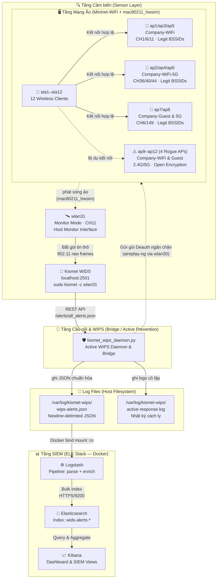

# 🛡️ Hệ Thống Giám Sát WIDS/WIPS Thực Tế Tích Hợp Kismet & SIEM ELK Stack Trong Môi Trường Mininet-WiFi

Dự án này tập trung vào việc **thiết kế, mô phỏng và triển khai một giải pháp phát hiện/ngăn chặn xâm nhập không dây (WIDS/WIPS) thực tế sử dụng Kismet WIDS**, sau đó tích hợp và chuẩn hóa dữ liệu cảnh báo thời gian thực vào hạ tầng **SIEM ELK Stack** (Elasticsearch, Logstash, Kibana) nhằm thực hiện quản lý, phân tích an ninh tập trung.

Hệ thống được thiết kế chạy **hoàn toàn trong môi trường Kali Linux**, tận dụng tối đa driver `mac80211_hwsim` giả lập sóng vô tuyến 802.11 thực sự để Kismet WIDS thu thập gói tin ở chế độ Monitor Mode qua card mạng ảo `wlan31` trực tiếp từ topo **Mininet-WiFi**.

---

## 🚀 Các Tính Năng Nổi Bật

1. **Giả Lập Sóng Wi-Fi Mật Độ Cao Thực Tế**: Sử dụng driver kernel `mac80211_hwsim` cấu hình 32 radios ảo kết hợp **Mininet-WiFi** để tạo ra môi trường sóng 802.11 thực sự, cho phép Kismet quét và bắt gói tin thô (raw frames) như môi trường vật lý.
2. **Phát Hiện Tấn Công Bằng Kismet WIDS**: Sử dụng công cụ Kismet chuyên nghiệp để giám sát và phát hiện các cuộc tấn công mạng vô tuyến thời gian thực:
   - **Evil Twin / Rogue AP** giả mạo SSID nội bộ `Company-WiFi` hoặc Guest `Company-Guest` không mã hóa.
   - **Deauthentication Flood** phá sóng gây gián đoạn kết nối hàng loạt client.
   - **Authentication Flood / Beacon Flood** tấn công DoS tài nguyên sóng.
   - **Unknown / Unregistered Client** kết nối trái phép vào mạng nội bộ.
3. **Bộ Ngăn Chặn Chủ Động Thực Tế (WIPS Active Containment)**:
   - **Cô lập mức sóng vô tuyến (Wireless Deauth Containment)**: Tự động dùng `aireplay-ng` qua card mạng ngăn chặn chuyên dụng `wlan30` gửi gói deauth liên tục ngắt kết nối giữa Rogue AP và client.
   - **Cô lập mức mạng (IP Blacklisting)**: Tự động chặn địa chỉ IP/MAC vi phạm và đưa vào danh sách đen tường lửa (`simulated_blacklist.txt`).
4. **Chuẩn Hóa & Tích Hợp SIEM**: Động cơ WIPS Daemon (`kismet_wips_daemon.py`) liên tục truy vấn REST API của Kismet, chuẩn hóa các cảnh báo thô sang cấu trúc JSON SIEM thống nhất, ghi log thời gian thực để **Logstash** phân tích và đẩy lên **Elasticsearch**.
5. **Trực Quan Hóa Tương Tác**: Dashboard bảo mật tập trung trên **Kibana** giúp quản trị viên nắm bắt nhanh chóng tình hình an ninh vô tuyến và đưa ra phản ứng kịp thời.
6. **Bảng Điều Khiển Hợp Nhất (`run_project.sh`)**: Script quản trị mạnh mẽ với giao diện Menu tương tác chuyên nghiệp, hỗ trợ tự động thiết lập/dọn dẹp driver, khởi chạy/tắt Mininet-WiFi topo và Docker Compose ELK Stack chỉ bằng một lệnh duy nhất.

### 🛠️ Công Nghệ Sử Dụng

| Thành phần | Công nghệ | Phiên bản |
|---|---|---|
| Giả lập sóng Wi-Fi | `mac80211_hwsim` + Mininet-WiFi | 32 radios |
| Phát hiện xâm nhập (WIDS) | Kismet | Latest |
| Cầu nối & Ngăn chặn (WIPS) | `kismet_wips_daemon.py` | Python 3.12 |
| Tấn công thực nghiệm | `aireplay-ng`, `mdk4` | aircrack-ng suite |
| SIEM | ELK Stack (Docker) | 9.0.1 |
| Hệ điều hành | Kali Linux | 2024+ |

---

## 📐 Kiến Trúc Luồng Dữ Liệu (Data Flow)



## 📂 Sơ Đồ Cấu Trúc Các Tệp Dự Án

```
📦 wireless-mobile-network-security-project/
├── run_project.sh              ← 🚀 Entry point chính (Bảng điều khiển)
├── setup_miniconda_env.sh      ← 🔧 Tự động cài đặt Miniconda & môi trường
├── .env                        ← 🔑 Cấu hình bảo mật Notion & Kismet API (gitignored)
├── README.md                   ← 📖 Hướng dẫn sử dụng & Tổng quan hệ thống
│
├── src/                        ← 💻 Mã nguồn ứng dụng
│   ├── dense_wifi_topology.py  ← Giả lập topo mạng Wi-Fi ảo Mininet-WiFi
│   ├── kismet_wips_daemon.py   ← WIPS Daemon & Cầu nối API
│   └── kali_wids_attacks.sh    ← Script phát động tấn công thực nghiệm
│
├── docs/                       ← 📚 Tài liệu kỹ thuật chuyên sâu
│   ├── DATA_FLOW.md            ← Sơ đồ luồng dữ liệu & JSON Schema
│   ├── kismet_siem_elk_plan.md ← Kế hoạch triển khai & Kịch bản demo
│   ├── kismet_siem_elk_checklist.md ← Checklist theo dõi tiến độ chi tiết
│   └── khung_bao_cao_de_tai.md ← Khung đề cương báo cáo đồ án
│
├── tools/                      ← 🔧 Công cụ hỗ trợ
│   ├── notion_sync.py          ← Đồng bộ checklist lên trang Notion
│   ├── fix_kismet_config.sh    ← Tự động hóa cấu hình Kismet WIDS
│   └── sync_git_upstream.sh    ← Script đồng bộ hóa Git Upstream
│
├── SIEM/                       ← 📊 Hạ tầng SIEM ELK Stack (Docker Compose)
│   ├── docker-compose.yml      ← Khởi tạo Elasticsearch, Logstash, Kibana
│   ├── logstash/
│   │   └── pipeline/           ← Định nghĩa Pipeline Logstash nhận dữ liệu
│   ├── kibana.yml              ← Tùy chỉnh tham số giao diện Kibana
│   └── generate_key.sh         ← Sinh khóa bảo mật phiên làm việc Kibana
│
├── kali/                       ← 🐧 Máy ảo Kali Linux phục vụ thực nghiệm
│   └── Vagrantfile             ← Định nghĩa cấu hình hạ tầng Vagrant
│
└── mininet-wifi/               ← 📡 Git Submodule dự án Mininet-WiFi gốc
```

---

## 🛠️ Hướng Dẫn Cài Đặt Hệ Thống Từ Máy Kali Linux Mới (Fresh Kali Setup)

Nếu bạn đang sử dụng một máy ảo hoặc máy vật lý **Kali Linux mới tinh (hoặc vừa cài đặt lại)**, hãy thực hiện tuần tự các bước dưới đây để cấu hình đầy đủ môi trường từ A - Z.

### Bước 1: Cập nhật hệ thống & Cài đặt các gói phụ thuộc cơ bản
Chạy lệnh sau để cập nhật danh sách repositories và cài đặt các công cụ cốt lõi (Git, Docker, Docker Compose, Kismet, Pip):
```bash
sudo apt update && sudo apt upgrade -y
sudo apt install git docker.io docker-compose kismet python3-pip curl -y
```

### Bước 2: Kích hoạt & Phân quyền dịch vụ Docker
Bật Docker chạy cùng hệ thống và cho phép người dùng hiện tại chạy docker không cần quyền `sudo`:
```bash
sudo systemctl enable --now docker
sudo usermod -aG docker $USER
# Áp dụng quyền mới ngay lập tức mà không cần khởi động lại máy
newgrp docker
```

### Bước 3: Tải mã nguồn dự án & Phân quyền thực thi
Clone dự án từ GitHub và phân quyền thực thi cho tất cả các script tự động hóa:
```bash
# Clone dự án (nếu bạn chưa tải về)
git clone https://github.com/ph4n10m1808/wireless-mobile-network-security-project.git
cd wireless-mobile-network-security-project

# Phân quyền thực thi toàn bộ thư mục
chmod +x run_project.sh setup_miniconda_env.sh src/*.sh src/*.py tools/*.py tools/*.sh SIEM/*.sh
```

### Bước 4: Cài đặt tự động môi trường (Miniconda, Python 3.12, Mininet-WiFi)
Chạy script cài đặt hợp nhất. Script này sẽ tự động:
1. Tải bản phân phối Miniconda3 (Python 3.12) chính thức.
2. Cài đặt vào `/opt/miniconda3` và tự động cấp quyền `777` để tài khoản hiện tại quản lý dễ dàng.
3. Tạo môi trường ảo conda tên `network` và cài đặt các thư viện Python chuyên dụng.
4. Cài đặt toàn bộ hệ thống giả lập Wi-Fi mật độ cao **Mininet-WiFi**.
```bash
sudo ./setup_miniconda_env.sh
```

### Bước 5: Cấu hình tài nguyên hệ thống cho SIEM ELK Stack
Hệ điều hành Kali Linux mới mặc định giới hạn bộ nhớ ảo rất thấp, dễ khiến Elasticsearch bị treo sập khi khởi động. Chạy lệnh sau để cấu hình tối ưu hóa tài nguyên:
```bash
# Tăng giới hạn bộ nhớ ảo ngay lập tức
sudo sysctl -w vm.max_map_count=262144

# Đảm bảo lưu cấu hình này kể cả khi khởi động lại máy
echo "vm.max_map_count=262144" | sudo tee -a /etc/sysctl.conf
```

---

## ⚡ Khởi Chạy Và Thực Nghiệm (Quick Start)

Mọi hoạt động quản trị của dự án đã được tự động hóa tối đa thông qua file runner duy nhất `run_project.sh` ở root.

### 1. Khởi chạy bằng Giao diện Menu Tương Tác

Hãy mở terminal tại thư mục gốc dự án trên Kali Linux và chạy:

```bash
sudo ./run_project.sh
```

Hệ thống sẽ hiển thị bảng điều khiển chuyên nghiệp với 10 tùy chọn:

- **Chọn `[1]`**: Khởi động mạng giả lập Mininet-WiFi + WIDS Bridge (chỉ test quét sóng, không kèm SIEM ELK).
- **Chọn `[2]`**: Khởi động toàn bộ hạ tầng: **Mạng Mininet-WiFi + Kismet WIDS + KÈM SIEM ELK Stack** (Khuyên dùng để demo).
- **Chọn `[3]`**: Tắt & dọn dẹp WIDS/WIPS và Mininet-WiFi (giữ SIEM nếu đang chạy).
- **Chọn `[4]`**: Tắt & dọn dẹp toàn bộ hệ thống (cả WIDS/WIPS lẫn SIEM).
- **Chọn `[5]`**: Chỉ khởi động cụm SIEM Docker (ELK Stack).
- **Chọn `[6]`**: Chỉ tắt cụm SIEM Docker.
- **Chọn `[7]`**: Tắt SIEM & xóa dữ liệu (reset volumes, giữ Docker images).
- **Chọn `[8]`**: Xóa hoàn toàn SIEM (volumes + images + logs — clean slate).
- **Chọn `[9]`**: Cấu hình & tối ưu hóa Kismet WIDS (AP Whitelist).
- **Chọn `[0]`**: Thoát.

Ngoài giao diện menu tương tác, `run_project.sh` cũng hỗ trợ **CLI mode** cho tự động hóa:

```bash
# Khởi động đầy đủ (mạng giả lập + SIEM)
sudo ./run_project.sh start --with-siem

# Chỉ khởi động mạng giả lập (không SIEM)
sudo ./run_project.sh start

# Tắt toàn bộ (mạng + SIEM)
sudo ./run_project.sh stop --with-siem

# Xem hướng dẫn đầy đủ
sudo ./run_project.sh --help
```

### 2. Kiểm Tra Trạng Thái Hệ Thống

Sau khi khởi chạy, bạn có thể kiểm tra nhanh tình trạng các thành phần:

```bash
# Kiểm tra Kismet WIDS đang chạy
curl -s http://localhost:2501/system/status.json | python3 -m json.tool

# Kiểm tra cụm SIEM ELK Stack
cd SIEM && docker-compose ps

# Theo dõi log WIPS real-time
tail -f /var/log/kismet-wips/wips-alerts.json
```

### 3. Thực Hiện Tấn Công Thử Nghiệm

Sau khi hệ thống giả lập đã khởi chạy hoàn tất (xuất hiện prompt `mininet-wifi>`), hãy mở một cửa sổ terminal mới trên Host Kali và thực thi:

```bash
sudo ./src/kali_wids_attacks.sh
```

Giao diện tấn công xuất hiện, cho phép bạn kích hoạt:

1. **Deauthentication Attack** bằng `aireplay-ng` cắt kết nối client.
2. **Authentication Flood DoS** bằng `mdk4` làm nghẽn sóng AP.
3. **Beacon Flood (Fake APs)** bằng `mdk4` làm nhiễu danh sách quét sóng của WIDS.
4. **Amok Mode Deauth** ngắt toàn bộ sóng kênh 11.

### 4. Cấu hình Whitelist bảo vệ trong Kismet (AP Spoofing Whitelist)

Để Kismet WIDS có thể tự động phân biệt được AP hợp lệ và Rogue AP (Evil Twin / SSID Spoofing), danh sách các MAC (BSSID) hợp lệ được cấu hình trong `/etc/kismet/kismet_site.conf` hoặc `/etc/kismet/kismet_alerts.conf` như sau:

```ini
# =========================================================================
# Whitelist bảo vệ mạng nội bộ giả lập (Dense Dual-Band Topology)
# =========================================================================

# 1. SSID "Company-WiFi" (2.4 GHz - AP1, AP3, AP5)
apspoof=CompanyWiFiRule:ssid="Company-WiFi",validmacs="02:00:00:00:A1:00,02:00:00:00:A2:00,02:00:00:00:A3:00"

# 2. SSID "Company-WiFi-5G" (5 GHz - AP2, AP4, AP6)
apspoof=CompanyWiFi5GRule:ssid="Company-WiFi-5G",validmacs="02:00:00:00:A1:50,02:00:00:00:A2:50,02:00:00:00:A3:50"

# 3. SSID "Company-Guest" (2.4 GHz - AP7)
apspoof=CompanyGuestRule:ssid="Company-Guest",validmacs="02:00:00:00:A4:00"

# 4. SSID "Company-Guest-5G" (5 GHz - AP8)
apspoof=CompanyGuest5GRule:ssid="Company-Guest-5G",validmacs="02:00:00:00:A4:50"
```

---

## 📊 Cấu Hình Dashboard Kibana SIEM

1. Mở trình duyệt Web trên Host truy cập: `https://localhost:5601`
2. Đăng nhập với tài khoản: **`elastic`** / Mật khẩu: **`Vsl@2026`**
3. Đi tới **Stack Management** > **Kibana** > **Data Views** và nhấn **Create data view**:
   - Name: `wids-alerts-*`
   - Timestamp field: `@timestamp`
4. Vào mục **Kibana** > **Dashboard** để tạo các biểu đồ trực quan hóa dữ liệu theo nhu cầu:
   - Biểu đồ tỷ lệ các loại tấn công vô tuyến (Deauth Flood, Rogue AP, Evil Twin).
   - Biểu đồ thời gian thực về tần suất các cuộc tấn công xảy ra.
   - Bảng theo dõi tương quan thiết bị vi phạm (BSSID, MAC Client, Channel).
   - Trực quan hóa nhật ký cô lập ngăn chặn của **Active WIPS** (`active-response.log`).

---

## 📚 Tài Liệu Tích Hợp Chi Tiết

- 📖 **[DATA_FLOW.md](docs/DATA_FLOW.md)**: Sơ đồ chuỗi sự kiện sequence, Gantt timeline, và JSON Event Schema chi tiết.
- 📝 **[kismet_siem_elk_checklist.md](docs/kismet_siem_elk_checklist.md)**: Sơ đồ cây quản lý tiến độ hoàn thiện đồ án bảo vệ trước hội đồng.
- 📕 **[kismet_siem_elk_plan.md](docs/kismet_siem_elk_plan.md)**: Kế hoạch triển khai, cấu hình chi tiết và kịch bản demo trực tiếp.
- 📗 **[khung_bao_cao_de_tai.md](docs/khung_bao_cao_de_tai.md)**: Khung nội dung báo cáo đề tài.
