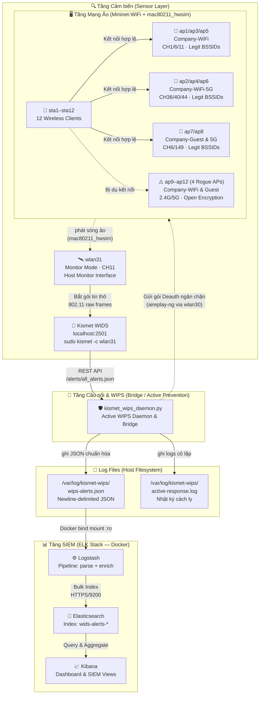

# 🛡️ Hệ Thống Giám Sát WIDS/WIPS Thực Tế Tích Hợp Kismet & SIEM ELK Stack Trong Môi Trường Mininet-WiFi

Dự án này tập trung vào việc **thiết kế, mô phỏng và triển khai một giải pháp phát hiện/ngăn chặn xâm nhập không dây (WIDS/WIPS) thực tế sử dụng Kismet WIDS**, sau đó tích hợp và chuẩn hóa dữ liệu cảnh báo thời gian thực vào hạ tầng **SIEM ELK Stack** (Elasticsearch, Logstash, Kibana) nhằm thực hiện quản lý, phân tích an ninh tập trung.

Hệ thống được thiết kế chạy **hoàn toàn trong môi trường Kali Linux**, tận dụng tối đa driver `mac80211_hwsim` giả lập sóng vô tuyến 802.11 thực sự để Kismet WIDS thu thập gói tin ở chế độ Monitor Mode qua card mạng ảo `wlan31` trực tiếp từ topo **Mininet-WiFi**.

---

## 🚀 Các Tính Năng Nổi Bật

1. **Giả Lập Sóng Wi-Fi Mật Độ Cao Thực Tế**: Sử dụng driver kernel `mac80211_hwsim` cấu hình 32 radios ảo kết hợp **Mininet-WiFi** để tạo ra môi trường sóng 802.11 thực sự, cho phép Kismet quét và bắt gói tin thô (raw frames) như môi trường vật lý.
2. **Phát Hiện Tấn Công Bằng Kismet WIDS**: Sử dụng công cụ Kismet chuyên nghiệp để giám sát và phát hiện các cuộc tấn công mạng vô tuyến thời gian thực:
   - **Evil Twin / Rogue AP** giả mạo SSID nội bộ `Company-WiFi` hoặc Guest `Company-Guest` không mã hóa.
   - **Deauthentication Flood** phá sóng gây gián đoạn kết nối hàng loạt client.
   - **Authentication Flood / Beacon Flood** tấn công DoS tài nguyên sóng.
   - **Unknown / Unregistered Client** kết nối trái phép vào mạng nội bộ.
3. **Bộ Ngăn Chặn Chủ Động Thực Tế (WIPS Active Containment)**:
   - **Cô lập mức sóng vô tuyến (Wireless Deauth Containment)**: Tự động dùng `aireplay-ng` qua card mạng ngăn chặn chuyên dụng `wlan30` gửi gói deauth liên tục ngắt kết nối giữa Rogue AP và client.
   - **Cô lập mức mạng (IP Blacklisting)**: Tự động chặn địa chỉ IP/MAC vi phạm và đưa vào danh sách đen tường lửa (`simulated_blacklist.txt`).
4. **Chuẩn Hóa & Tích Hợp SIEM**: Động cơ WIPS Daemon (`kismet_wips_daemon.py`) liên tục truy vấn REST API của Kismet, chuẩn hóa các cảnh báo thô sang cấu trúc JSON SIEM thống nhất, ghi log thời gian thực để **Logstash** phân tích và đẩy lên **Elasticsearch**.
5. **Trực Quan Hóa Tương Tác**: Dashboard bảo mật tập trung trên **Kibana** giúp quản trị viên nắm bắt nhanh chóng tình hình an ninh vô tuyến và đưa ra phản ứng kịp thời.
6. **Bảng Điều Khiển Hợp Nhất (`run_project.sh`)**: Script quản trị mạnh mẽ với giao diện Menu tương tác chuyên nghiệp, hỗ trợ tự động thiết lập/dọn dẹp driver, khởi chạy/tắt Mininet-WiFi topo và Docker Compose ELK Stack chỉ bằng một lệnh duy nhất.

---

## 📐 Kiến Trúc Luồng Dữ Liệu (Data Flow)



---

## 📂 Sơ Đồ Cấu Trúc Các Tệp Dự Án

- 📄 **`run_project.sh`**: Script cốt lõi điều khiển toàn bộ dự án (Khởi động SIEM, dọn dẹp card mạng, bật topo Mininet-WiFi, chạy bridge API ngầm).
- 📂 **`src/`**: Thư mục chứa mã nguồn chính của ứng dụng:
  - 📄 `dense_wifi_topology.py`: Script Python thiết lập mạng Wi-Fi ảo mật độ cao bằng Mininet-WiFi, tự động vá lỗi giữ driver và cấu hình card monitor `wlan31`.
  - 📄 `kismet_wips_daemon.py`: Động cơ ngăn chặn chủ động (WIPS) & API Bridge kết hợp, xử lý phát hiện, ghi logs chuẩn hóa và kích hoạt deauth cách ly qua `wlan30`.
  - 📄 `kali_wids_attacks.sh`: Shell script giả lập tấn công thực nghiệm sử dụng `aireplay-ng` và `mdk4` trên card `wlan30`.
- 📂 **`SIEM/`**: Chứa hạ tầng bảo mật SIEM chạy trên nền Docker:
  - 📄 `docker-compose.yml`: Khai báo 3 dịch vụ Elasticsearch, Logstash, Kibana (phiên bản v9.0.1 bảo mật cao).
  - 📂 `logstash/pipeline/logstash.conf`: Cấu hình tiếp nhận log file và đẩy index Elasticsearch.
  - 📄 `kibana.yml` & `generate_key.sh`: Cấu hình bảo mật mã hóa cho Kibana.
- 📄 **`DATA_FLOW.md`**: Tài liệu đặc tả kỹ thuật chi tiết về luồng dữ liệu, schema JSON sự kiện an ninh.
- 📄 **`kismet_siem_elk_plan.md`**: Bản kế hoạch triển khai, cấu hình chi tiết và các kịch bản demo bảo vệ đề tài.
- 📄 **`kismet_siem_elk_checklist.md`**: Sơ đồ cây theo dõi tiến độ hoàn thành các hạng mục công việc.
- 📄 **`kismet_wids_integration_guide.md`**: Tài liệu hướng dẫn cấu hình chi tiết cho Kismet WIDS.

---

## ⚡ Hướng Dẫn Sử Dụng Nhanh (Quick Start)

Mọi hoạt động quản trị của dự án đã được tự động hóa tối đa thông qua file runner duy nhất `run_project.sh`.

### 1. Phân quyền thực thi ban đầu

```bash
chmod +x run_project.sh src/*.sh src/*.py SIEM/*.sh
```

### 2. Khởi chạy bằng Giao diện Menu Tương Tác

Hãy mở terminal trên Kali Linux Host và chạy:

```bash
sudo ./run_project.sh
```

Hệ thống sẽ hiển thị bảng điều khiển chuyên nghiệp:

- Chọn `[1]` để khởi động mạng giả lập Mininet-WiFi + WIDS Bridge (không kèm SIEM).
- Chọn `[2]` để khởi động toàn bộ hạ tầng: **Mạng Mininet-WiFi + Kismet WIDS + KÈM SIEM ELK Stack**.
- Chọn `[3]` hoặc `[4]` để tắt và dọn dẹp sạch sẽ tài nguyên, card mạng ảo, và container rác.
- Chọn `[5]` hoặc `[6]` để quản lý độc lập cụm SIEM Docker.

### 3. Thực Hiện Tấn Công Thử Nghiệm

Sau khi hệ thống giả lập đã khởi chạy hoàn tất (xuất hiện prompt `mininet-wifi>`), hãy mở một cửa sổ terminal mới trên Host Kali và thực thi:

```bash
sudo ./src/kali_wids_attacks.sh
```

Giao diện tấn công xuất hiện, cho phép bạn kích hoạt:

1. **Deauthentication Attack** bằng `aireplay-ng` cắt kết nối client.
2. **Authentication Flood DoS** bằng `mdk4` làm nghẽn sóng AP.
3. **Beacon Flood (Fake APs)** bằng `mdk4` làm nhiễu danh sách quét sóng của WIDS.
4. **Amok Mode Deauth** ngắt toàn bộ sóng kênh 11.

### 4. Cấu hình Whitelist bảo vệ trong Kismet (AP Spoofing Whitelist)

Để Kismet WIDS có thể tự động phân biệt được AP hợp lệ và Rogue AP (Evil Twin / SSID Spoofing), danh sách các MAC (BSSID) hợp lệ được cấu hình trong `/etc/kismet/kismet_site.conf` hoặc `/etc/kismet/kismet_alerts.conf` như sau:

```ini
# =========================================================================
# Whitelist bảo vệ mạng nội bộ giả lập (Dense Dual-Band Topology)
# =========================================================================

# 1. SSID "Company-WiFi" (2.4 GHz - AP1, AP3, AP5)
apspoof=CompanyWiFiRule:ssid="Company-WiFi",validmacs="02:00:00:00:A1:00,02:00:00:00:A2:00,02:00:00:00:A3:00"

# 2. SSID "Company-WiFi-5G" (5 GHz - AP2, AP4, AP6)
apspoof=CompanyWiFi5GRule:ssid="Company-WiFi-5G",validmacs="02:00:00:00:A1:50,02:00:00:00:A2:50,02:00:00:00:A3:50"

# 3. SSID "Company-Guest" (2.4 GHz - AP7)
apspoof=CompanyGuestRule:ssid="Company-Guest",validmacs="02:00:00:00:A4:00"

# 4. SSID "Company-Guest-5G" (5 GHz - AP8)
apspoof=CompanyGuest5GRule:ssid="Company-Guest-5G",validmacs="02:00:00:00:A4:50"
```

---

## 📊 Cấu Hình Dashboard Kibana SIEM

1. Mở trình duyệt Web trên Host truy cập: `https://localhost:5601`
2. Đăng nhập với tài khoản: **`elastic`** / Mật khẩu: **`Vsl@2026`**
3. Đi tới **Stack Management** > **Kibana** > **Data Views** và nhấn **Create data view**:
   - Name: `wids-alerts-*`
   - Timestamp field: `@timestamp`
4. Vào mục **Kibana** > **Dashboard** để tạo các biểu đồ trực quan hóa dữ liệu theo nhu cầu:
   - Biểu đồ tỷ lệ các loại tấn công vô tuyến (Deauth Flood, Rogue AP, Evil Twin).
   - Biểu đồ thời gian thực về tần suất các cuộc tấn công xảy ra.
   - Bảng theo dõi tương quan thiết bị vi phạm (BSSID, MAC Client, Channel).
   - Trực quan hóa nhật ký cô lập ngăn chặn của **Active WIPS** (`active-response.log`).

---

## 📚 Tài Liệu Tích Hợp Chi Tiết

- 📖 **[DATA_FLOW.md](file:///home/ph4n10m/Code/wireless-mobile-network-security-project/DATA_FLOW.md)**: Sơ đồ chuỗi sự kiện sequence, Gantt timeline, và JSON Event Schema chi tiết.
- 📝 **[kismet_siem_elk_checklist.md](file:///home/ph4n10m/Code/wireless-mobile-network-security-project/kismet_siem_elk_checklist.md)**: Sơ đồ cây quản lý tiến độ hoàn thiện đồ án bảo vệ trước hội đồng.
- 📕 **[kismet_siem_elk_plan.md](file:///home/ph4n10m/Code/wireless-mobile-network-security-project/kismet_siem_elk_plan.md)**: Hướng dẫn cấu hình chi tiết Kismet API và kịch bản demo trực tiếp.
