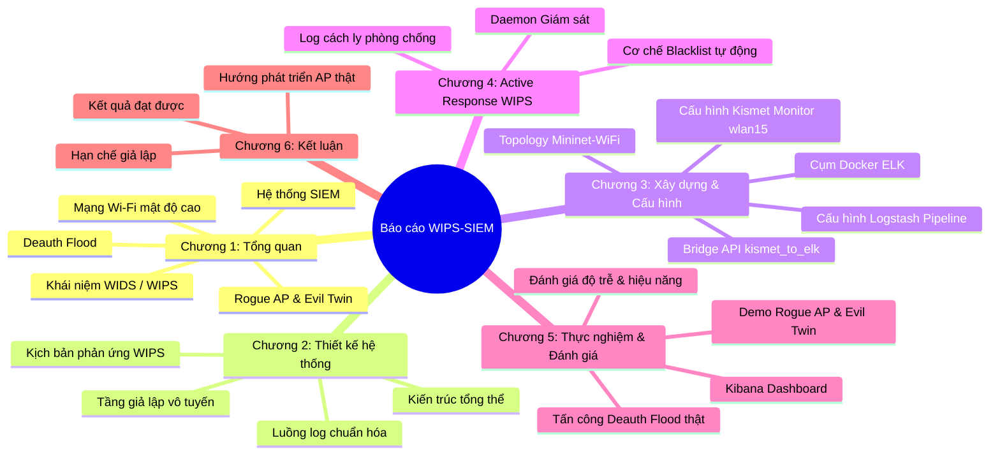

# 🎓 KHUNG BÁO CÁO ĐỀ TÀI CHUYÊN SÂU (REPORT FRAMEWORK)

## Đề tài: "Thiết kế và mô phỏng hệ thống ngăn chặn xâm nhập không dây WIPS trong môi trường Wi-Fi mật độ cao sử dụng Mininet-WiFi tích hợp ELK Stack SIEM"

> [!NOTE]
> Khung báo cáo này đã được tinh chỉnh toàn diện dựa trên tài liệu tham khảo `Triển khai WIDS SIEM Wazuh_1.pdf`, đồng thời cập nhật chính xác theo thực tế mã nguồn hiện tại của bạn: chuyển đổi từ **Wazuh** sang **ELK Stack (Elasticsearch, Logstash, Kibana)** làm SIEM chính, thay thế bộ sinh cảnh báo giả lập bằng **Kismet WIDS** thật bắt gói tin trên interface ảo `wlan15` trong chế độ Monitor Mode của Mininet-WiFi, sử dụng cầu nối API `kismet_to_elk.py` để gửi log chuẩn hóa, và loại bỏ các file sinh log mạng giả lập (`network_event_generator.py`) để tập trung tuyệt đối vào luồng log bảo mật từ Kismet.

---

## 📑 MỤC LỤC CHI TIẾT ĐỀ XUẤT

---

### CHƯƠNG 1: TỔNG QUAN VỀ AN TOÀN MẠNG KHÔNG DÂY VÀ SIEM

* **1.1. Thách thức bảo mật trong mạng Wi-Fi mật độ cao (High-Density Wi-Fi)**
  * Phân tích đặc thù môi trường doanh nghiệp lớn, trường học hoặc hội nghị.
  * Vấn đề quản lý thiết bị, sự chồng chéo kênh sóng, và các điểm yếu cố hữu của chuẩn 802.11.
* **1.2. Các kỹ thuật tấn công vô tuyến phổ biến**
  * **1.2.1. Rogue AP (Điểm truy cập trái phép):** Cách thức kẻ tấn công lắp đặt thiết bị AP lậu trong mạng nội bộ để bypass tường lửa.
  * **1.2.2. Evil Twin (Điểm truy cập sinh đôi độc hại):** Kỹ thuật giả mạo SSID của doanh nghiệp với cấu hình không mật khẩu (Open) hoặc giả mạo trang đăng nhập (Captive Portal) nhằm đánh cắp thông tin.
  * **1.2.3. Deauthentication Flood Attack (Tấn công từ chối dịch vụ vô tuyến):** Cơ chế gửi frame ngắt kết nối liên tục để ép Client rớt mạng hoặc ép Client chuyển vùng (roaming) sang AP giả mạo của kẻ tấn công.
* **1.3. Giải pháp WIDS và WIPS**
  * Định nghĩa, chức năng giám sát (WIDS) và chủ động ngăn chặn cách ly (WIPS).
  * So sánh cơ chế hoạt động của WIDS/WIPS dựa trên phần cứng chuyên dụng so với giả lập.
* **1.4. Hệ thống SIEM và vai trò quản lý log tập trung**
  * Giới thiệu về khái niệm SIEM (Security Information and Event Management).
  * Phân tích cấu trúc hạ tầng **ELK Stack** (Elasticsearch, Logstash, Kibana) đóng vai trò làm trung tâm tiếp nhận, chuẩn hóa và trực quan hóa các sự kiện an ninh mạng vô tuyến.

---

### CHƯƠNG 2: THIẾT KẾ KIẾN TRÚC HỆ THỐNG MÔ PHỎNG WIPS-SIEM

* **2.1. Yêu cầu thiết kế hệ thống**
  * Khả năng mô phỏng mạng Wi-Fi mật độ cao với nhiều AP và Station hoạt động song song.
  * Khả năng thu giữ gói tin vô tuyến thực tế (802.11 frames) từ môi trường giả lập.
  * Khả năng chuẩn hóa cấu trúc dữ liệu JSON đồng bộ và bảo mật đường truyền log SIEM qua mã hóa TLS.
  * Cơ chế tự động kích hoạt phản ứng (Active Response) ngăn chặn kẻ tấn công thời gian thực.
* **2.2. Kiến trúc tổng thể hệ thống (System Architecture)**
  * Chi tiết sơ đồ 4 phân tầng cốt lõi:
    1. **Tầng mạng ảo (Mininet-WiFi + mac80211_hwsim):** Tạo ra sóng Wi-Fi ảo, các AP hợp lệ và AP tấn công.
    2. **Tầng cảm biến (Kismet WIDS):** Sử dụng anten giám sát ảo (`wlan15`) chuyển sang Monitor Mode để thu giữ dữ liệu thô.
    3. **Tầng cầu nối & chuẩn hóa (kismet_to_elk.py):** Lấy cảnh báo từ Kismet REST API thông qua cookie-based session, chuẩn hóa schema JSON và ghi vào nhật ký trung gian.
    4. **Tầng SIEM trung tâm (ELK Stack):** Tiếp nhận log qua Logstash pipeline, lưu trữ tại Elasticsearch và hiển thị trên Kibana Dashboard.
* **2.3. Thiết kế luồng dữ liệu sự kiện an ninh (Security Data Flow)**
  * Sơ đồ tuần tự từ lúc xảy ra vụ tấn công vô tuyến $\rightarrow$ Card monitor thu giữ $\rightarrow$ Kismet sinh alert $\rightarrow$ Bridge script trích xuất $\rightarrow$ Logstash chuyển tiếp $\rightarrow$ Elasticsearch lập chỉ mục $\rightarrow$ Kibana cảnh báo.
* **2.4. Thiết kế Schema sự kiện chuẩn (Event Schema Standardization)**
  * Định nghĩa định dạng JSON chuẩn dùng chung cho hệ thống bao gồm: `timestamp`, `source`, `sensor`, `event_type`, `ssid`, `bssid`, `client_mac`, `channel`, `encryption`, `authorized` và các metadata thô của Kismet.

---

### CHƯƠNG 3: XÂY DỰNG VÀ CẤU HÌNH HỆ THỐNG

* **3.1. Thiết lập hạ tầng SIEM ELK Stack trong môi trường Docker Container**
  * **3.1.1. Cài đặt chứng chỉ SSL/TLS tự động:** Sử dụng dịch vụ Setup sinh CA và chứng chỉ nội bộ bảo mật kết nối HTTPS.
  * **3.1.2. Cấu hình Docker Compose:** Phân bổ tài nguyên (`mem_limit`, `vm.max_map_count`), mở cổng và bind mount thư mục lưu log `/var/log/virtual-wips` từ host Kali.
* **3.2. Cấu hình và tối ưu hóa Pipeline Logstash**
  * Thiết lập đầu vào (`input { file { path => "/usr/share/logstash/wids/wips-alerts.json" } }`).
  * Xây dựng bộ lọc (`filter`): Tự động phân tích JSON, thiết lập chỉ mục thời gian thực khớp sự kiện (`@timestamp`), và gán siêu dữ liệu index prefix cho Elasticsearch.
  * Loại bỏ Double Ingestion và các log mạng giả lập không liên quan để tối ưu băng thông.
* **3.3. Xây dựng môi trường giả lập mạng Wi-Fi mật độ cao**
  * Thiết lập mã nguồn `src/dense_wifi_topology.py` cấu hình 16 radios ảo bằng `mac80211_hwsim`.
  * Cấu hình monkey-patch vô hiệu hóa hành vi gỡ driver của Mininet-WiFi khi thoát nhằm bảo vệ card giám sát của host.
  * Khai báo vị trí tọa độ địa lý, thiết lập 3 AP hợp lệ (`Company-WiFi` kênh 1 và 6, `Company-Guest` kênh 11) và 8 Stations di động kết nối xen kẽ.
* **3.4. Cài đặt và cấu hình bộ cảm biến Kismet WIDS**
  * Tận dụng card mạng ảo dư thừa `wlan15`, chuyển đổi sang chế độ Monitor Mode và khóa (lock) vào kênh sóng số 11.
  * Khởi động `kismet` ngầm định hướng thu thập gói tin không dây ảo, vô hiệu hóa ghi đĩa sqlite cục bộ nhằm tối đa hóa hiệu năng xử lý gói.
* **3.5. Lập trình cầu nối API Kismet sang SIEM (`kismet_to_elk.py`)**
  * Cơ chế xác thực Session cookie thông qua `/session/check_session.json` của Kismet REST API.
  * Thuật toán khử trùng lặp cảnh báo (Deduplication) sử dụng tập hợp lưu trữ hash của Kismet alert.
  * Ánh xạ thông minh mức độ nghiêm trọng từ thang điểm 0-10 của Kismet sang chuẩn SIEM (`critical`, `high`, `medium`, `low`).

---

### CHƯƠNG 4: PHÁT TRIỂN MODULE PHẢN ỨNG CHỦ ĐỘNG WIPS (ACTIVE RESPONSE)

* **4.1. Sự cần thiết của cơ chế phản ứng mô phỏng**
  * Giải thích lý do hạn chế môi trường ảo hóa không có phần cứng Controller/AP thật để thực hiện kỹ thuật ngắt sóng vật lý.
  * Giải pháp: Xây dựng cơ chế cô lập lớp ứng dụng và tường lửa mô phỏng nhằm đảm bảo tính toàn vẹn của quy trình WIPS (Phát hiện $\rightarrow$ Cảnh báo $\rightarrow$ Ngăn chặn).
* **4.2. Xây dựng Engine Ngăn chặn tự động (`wips_elk_containment_simulator.py`)**
  * Kỹ thuật theo dõi tệp tin log thời gian thực (Cơ chế `tail -f` / `watch` không đồng bộ trong Python).
  * Trích xuất tự động các dấu hiệu xâm phạm (MAC của kẻ tấn công Deauth Flood, BSSID của Rogue AP/Evil Twin).
* **4.3. Triển khai cơ chế Blacklist & Nhật ký cách ly**
  * Tự động cập nhật danh sách đen (`simulated_blacklist.txt`) ghi nhận toàn bộ các thực thể độc hại bị phát hiện trong không gian vô tuyến ảo.
  * Lưu trữ nhật ký cách ly an ninh mạng đầy đủ tại `/var/log/virtual-wips/active-response.log` phục vụ công tác điều tra số (Digital Forensics) sau sự cố.

---

### CHƯƠNG 5: THỰC NGHIỆM, KIỂM THỬ VÀ ĐÁNH GIÁ KẾT QUẢ

* **5.1. Kịch bản thực nghiệm 1: Phát hiện và xử lý Rogue AP / Evil Twin**
  * **Các bước tiến hành:** Chạy topology $\rightarrow$ kích hoạt node `rogueap` phát SSID `Company-WiFi` open $\rightarrow$ client sta1 bị thu hút kết nối.
  * **Kết quả thu nhận:** Kismet phát hiện AP giả mạo trùng SSID nhưng sai BSSID $\rightarrow$ Kích hoạt cảnh báo mức độ **Critical** đẩy lên SIEM $\rightarrow$ Blacklist ghi nhận BSSID vi phạm.
* **5.2. Kịch bản thực nghiệm 2: Tấn công và ngăn chặn Deauthentication Flood thực tế**
  * **Các bước tiến hành:** Sử dụng công cụ `aireplay-ng` gửi dồn dập frame deauth thật trên card monitor ảo hướng tới client trong mạng ảo.
  * **Kết quả thu nhận:** Kismet bắt được mật độ frame deauth bất thường vượt ngưỡng $\rightarrow$ Ghi nhận log cảnh báo tấn công từ chối dịch vụ $\rightarrow$ Active response tự động bắt giữ MAC kẻ tấn công đưa vào diện cách ly.
* **5.3. Trực quan hóa và Tương quan dữ liệu an ninh trên Kibana SIEM Dashboard**
  * Thiết kế giao diện Dashboard chuyên nghiệp bao gồm:
    * Biểu đồ thời gian (Timeline) đếm số lượng tấn công vô tuyến thực tế.
    * Bản đồ phân tích mật độ các loại sự cố (Deauth Flood, Rogue AP, Evil Twin).
    * Bảng thống kê chi tiết BSSID giả mạo, cường độ sóng, và danh sách các MAC đang bị cô lập.
* **5.4. Đánh giá hiệu năng hệ thống**
  * Khảo sát độ trễ trung bình từ thời điểm thực hiện tấn công vật lý ảo đến khi Kibana SIEM cập nhật biểu đồ (Mục tiêu đạt $< 3$ giây).
  * Đánh giá độ chính xác của whitelist baseline và tỷ lệ dương tính giả (False Positive) của hệ thống.

---

### CHƯƠNG 6: KẾT LUẬN VÀ HƯỚNG PHÁT TRIỂN

* **6.1. Các kết quả đã đạt được của đề tài**
  * Xây dựng thành công môi trường mạng Wi-Fi ảo mật độ cao cực kỳ ổn định, không gây sập nguồn nhờ cấu hình bypass NetworkManager thông minh.
  * Tích hợp thành công bộ WIDS thực tế Kismet hoạt động mượt mà với hạ tầng SIEM ELK Stack doanh nghiệp.
  * Hoàn thiện đầy đủ quy trình khép kín của một hệ thống WIPS thông qua module Active Response.
* **6.2. Các hạn chế do điều kiện mô phỏng**
  * Môi trường ảo hóa chưa phản ánh trọn vẹn nhiễu sóng vật lý thực tế, sự suy hao khoảng cách, vật cản và môi trường sóng vô tuyến hỗn hợp.
* **6.3. Hướng phát triển tiếp theo của đề tài**
  * Tích hợp các thiết bị AP vật lý thật (như UniFi, Aruba) hỗ trợ giao thức Syslog/SNMP.
  * Triển khai hệ thống xác thực tập trung 802.1X (WPA3-Enterprise) kết hợp giải pháp kiểm soát truy cập NAC (Network Access Control) và tự động hóa điều phối SOAR.

---

> [!TIP]
>
> ### 💡 BÍ QUYẾT BẢO VỆ ĐỀ TÀI TRƯỚC HỘI ĐỒNG:
>
> Khi giảng viên đặt câu hỏi hóc búa: **"Đề tài ghi chữ 'Ngăn chặn' (Prevention - WIPS) nhưng em chạy lab ảo thì ngăn chặn thật bằng cách nào khi không có thiết bị switch/router/AP thật?"**
>
> **Bạn trả lời tự tin như sau:**
> *"Thưa thầy cô, do giới hạn hạ tầng phòng Lab không có Access Point doanh nghiệp hỗ trợ API chặn cứng hoặc tạo deauth-containment thật ngoài không khí. Vì vậy, đề tài tập trung chuyên sâu vào **Thiết kế kiến trúc hệ thống WIPS chuẩn doanh nghiệp** và xây dựng **Module Active Response mô phỏng**. Khi phát hiện tấn công, module này tự động trích xuất MAC/BSSID độc hại ghi vào tệp tin blacklist cách ly an ninh và ghi nhật ký xử lý. Trong thực tế doanh nghiệp, file blacklist này sẽ được tự động đồng bộ xuống API của Controller Wi-Fi (như Cisco WLC, Aruba) hoặc Firewall để chặn truy cập vật lý ngay lập tức."*

---

## 🛠️ FILE CHECKLIST CỦA BẠN (CẬP NHẬT TRẠNG THÁI MỚI NHẤT)

Dưới đây là bảng đối chiếu trực quan tiến độ thực hiện đề tài dựa trên những file bạn vừa thay đổi/xóa:

| Phân hệ / Công việc                  |      Trạng thái cũ      |              Trạng thái hiện tại              | Mô tả thay đổi kỹ thuật                                                                                                                                                                                                                                                                    |
| :--------------------------------------- | :-------------------------: | :-----------------------------------------------: | :----------------------------------------------------------------------------------------------------------------------------------------------------------------------------------------------------------------------------------------------------------------------------------------------- |
| **Giả lập mạng vô tuyến ảo** |          8 Radios          |        **16 Radios (Hoàn thành)**        | Nâng cấp radios lên 16 giúp tách biệt dải interface của Mininet-WiFi (`wlan0`-`wlan11`) và Host Kali (`wlan12`-`wlan15`), tránh tuyệt đối lỗi tranh chấp namespace gây treo đơ hệ thống.                                                                             |
| **Bảo vệ card Monitor**          |          Chưa có          |      **Bỏ qua rmmod (Hoàn thành)**      | Cấu hình monkey-patch trong `dense_wifi_topology.py` chặn lệnh `rmmod mac80211_hwsim` giúp wlan15 monitor mode được giữ nguyên khi tắt mạng ảo.                                                                                                                                 |
| **Tránh xung đột OS**           |          Chưa có          |  **Bỏ qua NetworkManager (Hoàn thành)**  | Tạo file cấu hình `99-unmanage-hwsim.conf` để NetworkManager bỏ qua toàn bộ card ảo `wlan*`, loại bỏ hoàn toàn lỗi sập nguồn/Kernel Panic của máy tính host Kali.                                                                                                         |
| **Tầng cảm biến giám sát**    |     Sinh log giả lập     |    **Kismet WIDS Thật (Hoàn thành)**    | Thay thế hoàn toàn file giả lập `virtual_wips_detector.py` đã xóa bằng hệ thống **Kismet WIDS thật** nghe sóng ảo trên card `wlan15` chế độ monitor.                                                                                                                 |
| **Cầu nối log an ninh**          |   Chưa chạy tự động   | **Tích hợp Bridge script (Hoàn thành)** | Chuyển đổi file khởi chạy trong `run_project.sh` từ `virtual_wips_detector.py` sang **`src/kismet_to_elk.py`** để lấy alert thật từ REST API Kismet và tự động chuẩn hóa sang log JSON.                                                                             |
| **Cấu hình Logstash**            | Hỗn hợp nhiều nguồn log | **Độc quyền Kismet Log (Hoàn thành)** | Tinh chỉnh file `logstash.conf` loại bỏ hoàn toàn input/filter của file sinh log mạng giả lập (`network_event_generator.py` đã xóa) và file log mẫu. Logstash hiện tại chỉ tiếp nhận và xử lý duy nhất luồng log WIDS từ Kismet để đẩy lên Elasticsearch SIEM. |
| **Giao diện Kibana SIEM**         |      Chưa cấu hình      |            **Đang thực hiện**            | Bạn chỉ cần import Data View `wids-alerts-*` và thiết kế các Dashboard Kibana theo mô tả ở Chương 5 để hoàn thiện 100% phần thực hành!                                                                                                                                      |
