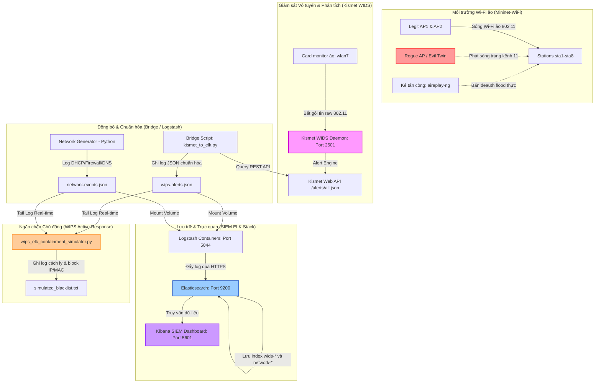

# Kế Hoạch Triển Khai & Mô Phỏng Hệ Thống WIDS/WIPS Thực Tế Sử Dụng Kismet WIDS Tích Hợp ELK Stack

Kế hoạch này được xây dựng và tùy biến để thay thế bộ giả lập WIDS bằng **Kismet WIDS** – hệ thống phát hiện xâm nhập không dây nguồn mở chuyên nghiệp của ngành an ninh mạng. Hệ thống chạy trên môi trường lai (Hybrid Emulation): giả lập sóng vô tuyến ảo bằng **Mininet-WiFi**, bắt gói tin bằng **Kismet WIDS** thực tế ở chế độ Monitor mode, và quản lý tập trung trên hạ tầng **ELK Stack (Elasticsearch, Logstash, Kibana)**.

> [!NOTE]
> Dự án chạy hoàn toàn trên máy host **Kali Linux** sử dụng driver vô tuyến giả lập nhân Linux `mac80211_hwsim` để tạo 8 card mạng ảo. Một card mạng ảo (ví dụ `wlan7`) sẽ được đưa vào chế độ **Monitor Mode** để Kismet làm "sensor" nghe trộm sóng ảo và phân tích.

---

## 1. Tổng Quan & Kiến Trúc Hệ Thống Kismet + ELK

### 1.1. Tên Đề Tài Đề Xuất
> **"Thiết kế và mô phỏng hệ thống ngăn chặn xâm nhập không dây WIPS thời gian thực sử dụng Kismet WIDS và hạ tầng ELK Stack trong môi trường Mininet-WiFi"**

### 1.2. Sơ Đồ Luồng Dữ Liệu Thực Nghiệm (Data Flow)


---

## 2. Thiết Kế Tích Hợp ELK Stack Cho Kismet

### 2.1. Cấu hình Docker Compose (Mount log từ Host vào Logstash)
Để Logstash có thể đọc cả log từ cầu nối Kismet (`wips-alerts.json`) hoặc log thô trực tiếp của Kismet (`/var/log/kismet`), cập nhật phần cấu hình dịch vụ `logstash` trong file `SIEM/docker-compose.yml` như sau:
```yaml
  logstash:
    depends_on:
      elasticsearch:
        condition: service_healthy
    image: docker.elastic.co/logstash/logstash:${STACK_VERSION}
    container_name: ecp-logstash
    volumes:
      - ./certs:/usr/share/logstash/config/certs:z
      - ./logstash/pipeline:/usr/share/logstash/pipeline:z
      - /var/log/virtual-wips:/usr/share/logstash/wids:ro
      - /var/log/virtual-network:/usr/share/logstash/network:ro
      - /var/log/kismet:/usr/share/logstash/kismet_raw:ro # Thêm mount thư mục log Kismet thô
      - ./sample.log:/usr/share/logstash/sample.log:z
    ports:
      - "5044:5044"
    restart: always
    environment:
      - ELASTIC_PASSWORD=${ELASTIC_PASSWORD}
      - LS_JAVA_OPTS=-Xms1g -Xmx1g
```

### 2.2. Tổ chức Pipeline Logstash Phân Tách
Chúng ta chia làm **2 file cấu hình** độc lập trong thư mục `SIEM/logstash/pipeline/`:
1. **`logstash.conf`**: Xử lý WIDS Python (chuẩn hóa qua Bridge hoặc script WIDS mô phỏng) và Network Events.
2. **`kismet.conf`**: Xử lý riêng biệt các cảnh báo thô trực tiếp từ Kismet.

*(Chi tiết mã nguồn 2 file này đã được cập nhật thành công tại [logstash.conf](file:///home/ph4n10m/Code/wireless-mobile-network-security-project/SIEM/logstash/pipeline/logstash.conf) và [kismet.conf](file:///home/ph4n10m/Code/wireless-mobile-network-security-project/SIEM/logstash/pipeline/kismet.conf)).*

---

## 3. Các Bước Triển Khai Thực Nghiệm

### Bước 1: Kích hoạt Driver Card Mạng Wi-Fi Ảo (`mac80211_hwsim`) trên Host Kali
Chạy lệnh sau để kích hoạt 8 card mạng ảo trên máy host Kali Linux:
```bash
sudo modprobe mac80211_hwsim radios=8
iw dev
```
*(wlan0 đến wlan7 sẽ xuất hiện).*

### Bước 2: Thiết lập Mạng Wi-Fi Mật Độ Cao (`dense_wifi_topology.py`)
Khởi chạy Mininet-WiFi để tạo môi trường sóng ảo, các AP hợp lệ và AP giả mạo (Evil Twin):
```bash
sudo python3 src/dense_wifi_topology.py
```

### Bước 3: Cài đặt & Triển khai Kismet WIDS (Thay thế cho Python WIDS gốc)
1. **Cài đặt Kismet trên Kali:**
   ```bash
   sudo apt update
   sudo apt install kismet -y
   ```
2. **Đưa card `wlan7` sang Monitor Mode làm ăng-ten cho Kismet:**
   ```bash
   sudo ip link set wlan7 down
   sudo iw dev wlan7 set type monitor
   sudo ip link set wlan7 up
   ```
3. **Khởi chạy Kismet Daemon quét trên card monitor mode:**
   ```bash
   sudo kismet -c wlan7 --no-sqlite
   ```
4. **Khởi chạy script Cầu nối API đồng bộ Log [kismet_to_elk.py](file:///home/ph4n10m/Code/wireless-mobile-network-security-project/src/kismet_to_elk.py):**
   ```bash
   python3 src/kismet_to_elk.py
   ```
   *Script này sẽ liên tục quét Kismet Web API, dịch các trường thô và xuất ra file `/var/log/virtual-wips/wips-alerts.json`.*

### Bước 4: Tạo Bộ sinh Sự kiện Mạng Tương quan (`network_event_generator.py`)
Khởi chạy bộ sinh log mạng (DHCP, DNS, Firewall) để phục vụ kịch bản tương quan SIEM:
```bash
python3 src/network_event_generator.py
```

### Bước 5: Thiết lập Quyền truy cập Log cho Container Logstash
Cấp quyền đọc/ghi cho container Docker truy cập file log trên Host:
```bash
sudo chmod -R 755 /var/log/virtual-wips
sudo chmod -R 755 /var/log/virtual-network
sudo touch /var/log/virtual-wips/wips-alerts.json
sudo touch /var/log/virtual-network/network-events.json
sudo chmod 666 /var/log/virtual-wips/wips-alerts.json
sudo chmod 666 /var/log/virtual-network/network-events.json
```

---

## 4. WIPS Active Response - Động Cơ Phản Ứng Chủ Động

Động cơ phản ứng chủ động [wips_elk_containment_simulator.py](file:///home/ph4n10m/Code/wireless-mobile-network-security-project/src/wips_elk_containment_simulator.py) sẽ liên tục theo dõi (tail) file log JSON của WIDS (do `kismet_to_elk.py` ghi nhận). 

Khi Kismet phát hiện tấn công mạng không dây:
1. Nó đẩy alert qua REST API.
2. Script Bridge chuyển hóa thành sự kiện JSON và ghi vào `wips-alerts.json`.
3. Daemon Active Response bắt được sự kiện `evil_twin_detected` hoặc `deauth_flood` và lập tức chặn cách ly MAC/IP vi phạm bằng cách ghi vào `simulated_blacklist.txt`.
4. Ghi nhận nhật ký cách ly vào `/var/log/virtual-wips/active-response.log` để Kibana hiển thị sự thành công của WIPS.

---

## 5. Kịch Bản Tấn Công Thực Tế Tạo Cảnh Báo Cho Kismet (Live Demo)

Để Kismet phát hiện và hệ thống SIEM hoạt động, bạn **phải thực hiện các hành vi tấn công thật** trên card vô tuyến ảo của máy host Kali:

### Kịch bản 1: Tấn công Deauthentication Flood (Phát hiện Deauth Flood)
Sử dụng công cụ `aireplay-ng` bắn liên tục các gói tin hủy xác thực giả mạo để ngắt kết nối của các client ảo trong Mininet-WiFi:
```bash
# Gửi 150 gói deauth giả mạo AP1 (00:00:00:00:01:00) tới client sta1 (DE:AD:BE:EF:00:01)
sudo aireplay-ng -0 150 -a 00:00:00:00:01:00 -c DE:AD:BE:EF:00:01 wlan7
```
* **Phản ứng của WIDS:** Kismet phát hiện số lượng gói deauth vượt ngưỡng $\rightarrow$ Kích hoạt cảnh báo `DEAUTH_FLOOD`.
* **Phản ứng của SIEM:** Logstash nhận log $\rightarrow$ Đẩy lên Dashboard $\rightarrow$ Active Response đưa MAC kẻ tấn công vào `simulated_blacklist.txt`.

### Kịch bản 2: Tấn công Evil Twin (Phát hiện Rogue AP)
Khi Mininet-WiFi chạy `dense_wifi_topology.py`, node `rogueap` sẽ phát sóng SSID `Company-WiFi` nhưng dùng mã hóa Open trên kênh 11.
* **Phản ứng của WIDS:** Kismet quét qua kênh 11, phát hiện AP lạ phát trùng SSID nội bộ nhưng sai địa chỉ BSSID và cấu hình mã hóa Open $\rightarrow$ Kích hoạt cảnh báo `evil_twin_detected` / `rogue_ap_detected`.
* **Phản ứng của SIEM:** Đẩy alert mức `Critical` lên Kibana $\rightarrow$ Active Response cách ly BSSID của Rogue AP.

---

## 6. Kịch Bản Demo & Hướng Dẫn Thuyết Trình Đồ Án Kismet

Mở **6 cửa sổ Terminal** chuyên nghiệp trên màn hình Kali Linux để trình diễn trực quan luồng tương quan SIEM:

| Terminal | Lệnh thực thi | Mục tiêu trình diễn |
| :--- | :--- | :--- |
| **Terminal 1** | `cd SIEM && docker-compose up -d` | Khởi động hạ tầng ELK Stack. |
| **Terminal 2** | `sudo python3 src/dense_wifi_topology.py` | Tạo môi trường mạng vô tuyến giả lập bằng Mininet-WiFi. |
| **Terminal 3** | `sudo kismet -c wlan7 --no-sqlite` | Chạy real WIDS Kismet lắng nghe trên card vô tuyến ảo monitor mode. |
| **Terminal 4** | `python3 src/kismet_to_elk.py` | Khởi chạy cầu nối API đồng bộ log Kismet sang JSON ELK theo thời gian thực. |
| **Terminal 5** | `python3 src/network_event_generator.py` | Chạy bộ sinh log mạng giả lập (DHCP, Firewall, DNS) để phục vụ tương quan. |
| **Terminal 6** | `python3 src/wips_elk_containment_simulator.py` | Chạy Active Response Engine để tự động khóa IP/MAC vi phạm vào blacklist. |
| **Terminal 7 (Tấn công)** | `sudo aireplay-ng -0 100 -a ...` | Thực hiện tấn công thật để Hội đồng thấy log nhảy liên tục qua các Terminal và hiển thị tức thời trên Kibana Dashboard (< 3 giây). |

### Các lập luận "ăn điểm" thuyết phục hội đồng với Kismet WIDS:
1. **Tính thực tiễn cao:** Đề tài không chỉ dừng lại ở lý thuyết giả lập, mà đã tích hợp thành công **Kismet WIDS thật** - công cụ tiêu chuẩn ngành được các chuyên gia bảo mật sử dụng toàn cầu.
2. **Kỹ thuật sniffing tiên tiến:** Sử dụng card mạng ảo ở chế độ **Monitor Mode** kết hợp driver kernel `mac80211_hwsim` để bắt trực tiếp các khung hình 802.11 ảo, giải quyết được bài toán ảo hóa card Wi-Fi trên các máy ảo (VMware/VirtualBox).
3. **Kiến trúc phân tách (Decoupled Architecture):** Sử dụng API bridge giúp hệ thống SIEM cực kỳ linh hoạt. Khi triển khai thực tế, chỉ cần thay card mạng ảo bằng card mạng vật lý USB (như Alfa AWUS036ACM), hệ thống sẽ lập tức giám sát và bảo vệ văn phòng thật mà không cần thay đổi bất kỳ dòng cấu hình ELK nào!
