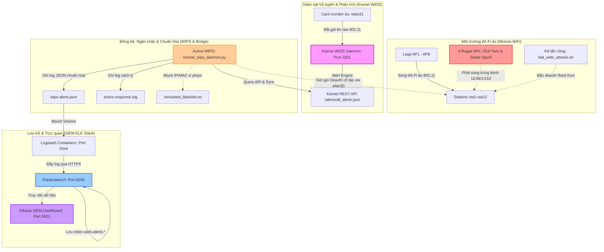

# 📑 Kế Hoạch Triển Khai & Thực Nghiệm Hệ Thống WIDS/WIPS Thực Tế Sử Dụng Kismet & ELK Stack

Tài liệu này trình bày chi tiết kế hoạch triển khai, cấu trúc luồng dữ liệu thực tế và kịch bản thực nghiệm kiểm thử cho hệ thống **WIDS/WIPS lai (Hybrid WIDS/WIPS)**. Hệ thống kết hợp giả lập môi trường Wi-Fi mật độ cao bằng **Mininet-WiFi**, bắt gói tin thật ở chế độ Monitor Mode bằng công cụ tiêu chuẩn **Kismet WIDS**, và quản lý an ninh tập trung trên cụm **SIEM ELK Stack (Elasticsearch, Logstash, Kibana)**.

---

## 1. Kiến Trúc Luồng Dữ Liệu Thực Nghiệm (Data Flow)

Kiến trúc hệ thống được thiết kế để Kismet WIDS trực tiếp bắt và phân tích gói tin 802.11 thô từ không gian vô tuyến ảo (mac80211_hwsim), sau đó qua bộ WIPS Active Response tự động thực hiện cô lập và đẩy log chuẩn hóa lên SIEM.



---

## 2. Thiết Kế Tích Hợp ELK Stack Cho Kismet

### 2.1. Cấu hình Volume Mount trong Docker Compose
Dữ liệu log được đồng bộ từ Host vào container Logstash thông qua bind mount thư mục chia sẻ `/var/log/kismet-wips/`. Cấu hình dịch vụ `logstash` trong tệp `SIEM/docker-compose.yml` được tối ưu hóa như sau:

```yaml
  logstash:
    depends_on:
      elasticsearch:
        condition: service_healthy
    image: docker.elastic.co/logstash/logstash:${STACK_VERSION}
    container_name: ecp-logstash
    volumes:
      - ./certs:/usr/share/logstash/config/certs:z
      - ./logstash/pipeline:/usr/share/logstash/pipeline:z
      - /var/log/kismet-wips:/usr/share/logstash/wids:ro # Mount thư mục log WIPS & Kismet Bridge
    ports:
      - "5044:5044"
    restart: always
    environment:
      - ELASTIC_PASSWORD=${ELASTIC_PASSWORD}
      - LS_JAVA_OPTS=-Xms1g -Xmx1g
```

### 2.2. Pipeline Logstash Tinh Chỉnh (`SIEM/logstash/pipeline/logstash.conf`)
Đầu vào và bộ lọc được thiết kế chuyên biệt để chỉ nhận duy nhất luồng dữ liệu an ninh WIDS từ file log chuẩn hóa `wips-alerts.json`:

```ruby
input {
  # Nhận log từ hệ thống WIDS ảo (đã chuẩn hóa qua kismet_wips_daemon)
  file {
    path => "/usr/share/logstash/wids/wips-alerts.json"
    codec => "json"
    start_position => "beginning"
    sincedb_path => "/dev/null"
    tags => ["wids", "wireless"]
  }
}

filter {
  if "wids" in [tags] {
    mutate {
      add_field => { "[@metadata][index_prefix]" => "wids-alerts" }
    }
    date {
      match => [ "timestamp", "ISO8601" ]
      target => "@timestamp"
    }
  }
}

output {
  if "wids" in [tags] {
    elasticsearch {
      hosts => ["https://ecp-elasticsearch:9200"]
      user => "elastic"
      password => "${ELASTIC_PASSWORD}"
      ssl_enabled => true
      ssl_certificate_authorities => ["/usr/share/logstash/config/certs/ca/ca.crt"]
      index => "%{[@metadata][index_prefix]}-%{+YYYY.MM.dd}"
    }
  }
}
```

### 2.3. Cấu hình Whitelist bảo vệ trong Kismet (AP Spoofing Detection)
Để Kismet WIDS có thể tự động phân biệt được AP hợp lệ và Rogue AP (Evil Twin / SSID Spoofing), danh sách các MAC (BSSID) hợp lệ được cấu hình trong `/etc/kismet/kismet_site.conf` như sau:

```ini
# =========================================================================
# Whitelist bảo vệ mạng nội bộ giả lập (Dense Dual-Band Topology)
# =========================================================================

# 1. Bảo vệ SSID "Company-WiFi" (2.4 GHz - AP1, AP3, AP5)
apspoof=CompanyWiFiRule:ssid="Company-WiFi",validmacs="02:00:00:00:A1:00,02:00:00:00:A2:00,02:00:00:00:A3:00"

# 2. Bảo vệ SSID "Company-WiFi-5G" (5 GHz - AP2, AP4, AP6)
apspoof=CompanyWiFi5GRule:ssid="Company-WiFi-5G",validmacs="02:00:00:00:A1:50,02:00:00:00:A2:50,02:00:00:00:A3:50"

# 3. Bảo vệ SSID "Company-Guest" (2.4 GHz - AP7)
apspoof=CompanyGuestRule:ssid="Company-Guest",validmacs="02:00:00:00:A4:00"

# 4. Bảo vệ SSID "Company-Guest-5G" (5 GHz - AP8)
apspoof=CompanyGuest5GRule:ssid="Company-Guest-5G",validmacs="02:00:00:00:A4:50"
```

---

## 3. Quy Trình Thực Nghiệm Từng Bước

### Bước 1: Khởi động Toàn bộ Hạ tầng bằng `run_project.sh`
Thay vì phải cấu hình thủ công từng thành phần, bạn chỉ cần thực thi script điều khiển hợp nhất:
```bash
sudo ./run_project.sh
```
* **Chọn Menu `[2]`**: Hệ thống sẽ tự động thực hiện:
  1. Khởi động cụm SIEM Docker (Elasticsearch, Logstash, Kibana) ngầm.
  2. Nạp driver `mac80211_hwsim` cấu hình **32 radios ảo** (wlan0 đến wlan32).
  3. Cấu hình NetworkManager để bỏ qua toàn bộ card mạng ảo `wlan*`, tránh Kernel Panic.
  4. Khởi chạy topo mạng Mininet-WiFi (`dense_wifi_topology.py`).
  5. Đưa card `wlan31` sang chế độ **Monitor Mode** khóa kênh 11.
  6. Khởi động ngầm **Kismet WIDS** lắng nghe trên card `wlan31`.
  7. Khởi chạy ngầm **Active WIPS Daemon** (`kismet_wips_daemon.py`) để bắt đầu poll API.

### Bước 2: Thực Hiện Kịch Bản Tấn Công Để Kích Hoạt WIDS
Mở một Terminal mới trên Host Kali và thực thi script tấn công:
```bash
sudo ./src/kali_wids_attacks.sh
```

#### 🛡️ Kịch bản 1: Tấn công Deauthentication Flood (Phát hiện và Cô lập)
* Trên menu của `kali_wids_attacks.sh`, chọn **`1`** (Deauth Attack) hoặc **`4`** (Amok Deauth).
* Script sẽ sử dụng `aireplay-ng` qua card chuyên dụng `wlan30` gửi hàng loạt deauth frame.
* **Quy trình xử lý tự động**:
  1. Kismet phát hiện mật độ Deauth bất thường $\rightarrow$ Sinh cảnh báo qua REST API.
  2. `kismet_wips_daemon.py` poll được cảnh báo $\rightarrow$ Tạo sự kiện JSON lưu vào `wips-alerts.json`.
  3. Logstash phát hiện tệp log thay đổi $\rightarrow$ Đẩy lên Elasticsearch.
  4. Đồng thời, `kismet_wips_daemon.py` phát hiện cuộc tấn công Deauth $\rightarrow$ Tự động trích xuất MAC kẻ tấn công đưa vào tường lửa chặn (`simulated_blacklist.txt`) và ghi nhật ký chặn vào `active-response.log`.

#### 🛡️ Kịch bản 2: Tấn công Evil Twin / Rogue AP
* Khi Mininet-WiFi khởi chạy, các node rogueAP `ap9-ap12` tự động phát sóng giả mạo SSID `Company-WiFi` và `Company-Guest` không mã hóa.
* **Quy trình xử lý tự động**:
  1. Kismet quét qua kênh 11/36, phát hiện AP giả mạo trùng SSID nhưng sai BSSID và cấu hình bảo mật $\rightarrow$ Sinh alert `SSID_SPOOFING` / `ROGUE_AP`.
  2. `kismet_wips_daemon.py` ghi nhận sự kiện $\rightarrow$ Tự động kích hoạt **Wireless Deauth Containment**: dùng `aireplay-ng` qua card `wlan30` liên tục bắn gói deauth vào AP giả mạo này để ngăn cản client ảo `sta*` kết nối vào nó.
  3. Ghi log cô lập vào `active-response.log` và chuyển tiếp thông tin an ninh lên Kibana Dashboard.

---

## 4. Kịch Bản Demo & Hướng Dẫn Thuyết Trình Trước Hội Đồng

Để thuyết trình đề tài một cách ấn tượng và thuyết phục nhất, hãy mở các cửa sổ Terminal như sau:

| Terminal | Mục tiêu trình diễn | Chi tiết hiển thị |
| :--- | :--- | :--- |
| **Terminal 1** (Host) | Bảng điều khiển `run_project.sh` | Show quá trình cấu hình Driver 16 radios, tự động cấu hình bypass NetworkManager, và prompt điều khiển Mininet-WiFi (`mininet-wifi>`). |
| **Terminal 2** (Host) | Monitor Log Cô lập | Chạy lệnh `tail -f /var/log/kismet-wips/active-response.log` để show thời gian thực WIPS tự động kích hoạt ngăn chặn, block IP/MAC và kích hoạt deauth cách ly. |
| **Terminal 3** (Host) | Trình tấn công `kali_wids_attacks.sh` | Thực hiện các tùy chọn tấn công trực quan (bắn deauth, beacon flood). |
| **Trình duyệt Web** | Giao diện Kibana SIEM | Truy cập `https://localhost:5601`, trình diễn Dashboard tương quan an ninh vô tuyến trực quan, biểu đồ timeline nhảy vọt ngay khi bấm tấn công (độ trễ < 3 giây). |

### 💡 Các lập luận "đắt giá" bảo vệ đề tài:
1. **Khắc phục triệt để hạn chế tài nguyên**: Sử dụng driver `mac80211_hwsim` với 32 radios giúp cách ly hoàn toàn môi trường mạng thật của Host (`wlan0`) với môi trường Mininet-WiFi (`wlan1-24`) và các card an ninh (`wlan30-31`), đảm bảo lab chạy cực kỳ ổn định không bị mất mạng hay treo đơ máy.
2. **Kỹ thuật sniffer lai thực tế (Hybrid Emulation)**: Hệ thống sử dụng công cụ WIDS tiêu chuẩn **Kismet** thực thụ để bắt và phân tích frame thô 802.11 ảo, chứng minh khả năng làm chủ công nghệ WIDS/WIPS cấp độ doanh nghiệp.
3. **Quy trình WIPS khép kín và tự động**: WIPS daemon không chỉ cảnh báo mà còn chủ động phản ứng bằng cơ chế phản kích vô tuyến (Deauth Containment qua `wlan30`) và ngăn chặn mạng (Blacklist), giải quyết trọn vẹn bài toán phản ứng phòng vệ vô tuyến.
