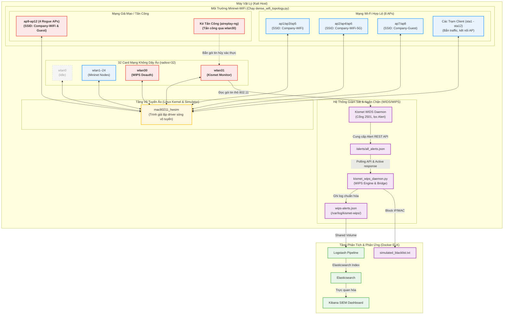

# Hướng Dẫn Tích Hợp Kismet WIDS Vào Hệ Thế ELK SIEM & Mininet-WiFi
Tài liệu này phân tích tính khả thi, ưu/nhược điểm và hướng dẫn chi tiết cách thay thế bộ giả lập `virtual_wips_detector.py` bằng công cụ giám sát vô tuyến chuyên nghiệp **Kismet WIDS** trong môi trường giả lập mạng không dây ảo hóa.

---

## 💡 Câu trả lời nhanh: HOÀN TOÀN ĐƯỢC VÀ CỰC KỲ KHUYẾN NGHỊ!

Việc sử dụng **Kismet** thay thế cho script giả lập giúp đề tài/đồ án của bạn nâng tầm từ **"Mô phỏng/Giả lập lý thuyết"** lên thành **"Hệ thống Thực nghiệm Lai (Hybrid Emulation System)"**. Lúc này, hệ thống sẽ chạy một công cụ WIDS thực tế của ngành an ninh mạng để phân tích trực tiếp các gói tin 802.11 thực được truyền tải qua driver sóng vô tuyến ảo của Linux kernel.

---

## 📊 Bảng so sánh: Kismet WIDS vs. Virtual Detector Script

| Tiêu chí | 🐍 Virtual Detector Script (`virtual_wips_detector.py`) | 📡 Kismet WIDS (Hệ thống Thật) |
| :--- | :--- | :--- |
| **Bản chất** | Giả lập sự kiện bằng cách sinh log JSON ngẫu nhiên theo kịch bản định sẵn. | Công cụ Sniffer & WIDS chuyên dụng thực tế, bắt và phân tích gói tin vô tuyến thời gian thực. |
| **Độ chân thực** | **Thấp** (Chỉ mô phỏng dữ liệu đầu ra của WIDS để SIEM xử lý). | **Tuyệt đối** (Phát hiện dựa trên các khung hình vô tuyến 802.11 thực sự bay trong không gian ảo). |
| **Độ tin cậy Demo** | **100%** (Không sợ lỗi phần cứng, lỗi driver hay thiếu gói tin khi thuyết trình trước Hội đồng). | **Trung bình** (Đòi hỏi card mạng ảo hoạt động ổn định và phải thực hiện tấn công thật để sinh log). |
| **Độ khó triển khai** | **Cực kỳ dễ** (Chỉ cần chạy file Python có sẵn). | **Cao** (Yêu cầu cài đặt Kismet, cấu hình interface monitor mode và viết script cầu nối API). |
| **Giá trị học thuật** | Phù hợp để minh họa luồng hoạt động tổng quan và cơ chế tương quan SIEM. | **Điểm tuyệt đối (10/10)**, chứng minh khả năng làm chủ công cụ thực tế và môi trường giả lập mạng sâu. |

---

## 🏗️ Kiến Trúc Luồng Dữ Liệu Tích Hợp Kismet

Khi tích hợp Kismet, luồng dữ liệu của hệ thống SIEM sẽ thay đổi như sau để đảm bảo tính thực tế mà không phá vỡ cấu trúc pipeline ELK đã xây dựng:



> [!NOTE]
> Để tránh việc phải cấu hình lại toàn bộ bộ lọc Logstash phức tạp và Dashboard Kibana, chúng ta sử dụng một bộ điều khiển trung tâm: [kismet_wips_daemon.py](file:///home/ph4n10m/Code/wireless-mobile-network-security-project/src/kismet_wips_daemon.py). Daemon này sẽ tự động kéo các cảnh báo thô từ Kismet API, dịch chúng sang cấu trúc JSON chuẩn hóa tương thích ngược 100% với hệ thống SIEM cũ, đồng thời tự động kích hoạt phản ứng ngăn chặn deauth và cập nhật tường lửa blacklist.

---

## 🛠️ Các Bước Thay Thế Kismet Ở Bước 3

### Bước 3.1: Cài đặt Kismet trên Kali Linux
Chạy lệnh sau trên máy Kali Linux để cài đặt phiên bản Kismet mới nhất từ repository chính thức:
```bash
sudo apt update
sudo apt install kismet -y
```

### Bước 3.2: Chuyển Card Mạng Giả Lập sang Monitor Mode
Trong danh sách 32 card mạng ảo được sinh ra từ driver `mac80211_hwsim`, ta sẽ chọn một interface (ví dụ `wlan31`) không được Mininet-WiFi sử dụng để làm "Ăng-ten giám sát" (WIDS Sensor).

Chạy các lệnh sau để đưa card `wlan31` vào trạng thái giám sát:
```bash
# Tắt interface
sudo ip link set wlan31 down

# Chuyển đổi chế độ hoạt động sang Monitor mode
sudo iw dev wlan31 set type monitor

# Bật lại interface
sudo ip link set wlan31 up

# Kiểm tra lại trạng thái (đảm bảo hiển thị type monitor)
iw dev wlan31
```

### Bước 3.3: Khởi cấu hình Kismet quét trên Card mạng ảo
Khởi động Kismet daemon và chỉ định nguồn bắt gói tin là card `wlan31` vừa cấu hình:
```bash
sudo kismet -c wlan31 --log-prefix /var/log/kismet-wips/
```
*Lưu ý:* Việc dùng cờ `--log-prefix` chỉ định thư mục giúp Kismet tự động ghi các tệp pcapng và sqlite database (`.kismet`) vào thư mục `/var/log/kismet-wips/` phục vụ cho mục đích điều tra số, không làm rác thư mục chạy hiện tại.

### Bước 3.3.B: Cấu hình Whitelist bảo vệ (AP Spoofing Detection)
Để Kismet WIDS có thể phân biệt chính xác đâu là AP hợp lệ của hệ thống và đâu là Rogue AP (Evil Twin / SSID Spoofing), bạn cần định nghĩa danh sách MAC (BSSID) được phép hoạt động ứng với từng SSID hợp lệ. 

Mở file cấu hình ghi đè của Kismet (khuyến nghị dán vào **`/etc/kismet/kismet_site.conf`** hoặc **`/etc/kismet/kismet_alerts.conf`**):
```bash
sudo nano /etc/kismet/kismet_site.conf
```

Sau đó thêm cấu hình Whitelist an ninh mạng đã được đồng bộ 100% với topology mật độ cao 8 APs của dự án:
```ini
# =========================================================================
# Whitelist bảo vệ mạng nội bộ giả lập (Dense Dual-Band Topology)
# =========================================================================

# 1. Bảo vệ SSID "Company-WiFi" (2.4 GHz - AP1, AP3, AP5)
apspoof=CompanyWiFiRule:ssid="Company-WiFi",validmacs="02:00:00:00:A1:00,02:00:00:00:A2:00,02:00:00:00:A3:00"

# 2. Bảo vệ SSID "Company-WiFi-5G" (5 GHz - AP2, AP4, AP6)
apspoof=CompanyWiFi5GRule:ssid="Company-WiFi-5G",validmacs="02:00:00:00:A1:50,02:00:00:00:A2:50,02:00:00:00:A3:50"

# 3. Bảo vệ SSID "Company-Guest" (2.4 GHz - AP7)
apspoof=CompanyGuestRule:ssid="Company-Guest",validmacs="02:00:00:00:A4:00"

# 4. Bảo vệ SSID "Company-Guest-5G" (5 GHz - AP8)
apspoof=CompanyGuest5GRule:ssid="Company-Guest-5G",validmacs="02:00:00:00:A4:50"
```

### Bước 3.4: Khởi Chạy WIPS Active Response Daemon [kismet_wips_daemon.py](file:///home/ph4n10m/Code/wireless-mobile-network-security-project/src/kismet_wips_daemon.py)
Khởi chạy daemon WIPS an ninh mạng mà chúng tôi đã xây dựng sẵn cho bạn tại thư mục `src/`:
```bash
sudo python3 src/kismet_wips_daemon.py
```
Script này hoạt động như một daemon liên tục giám sát Kismet API (mặc định tại cổng `2501`), tự động ghi nhận log chuẩn hóa vào `/var/log/kismet-wips/wips-alerts.json` bất cứ khi nào Kismet phát hiện mối đe dọa không dây thực tế, đồng thời gửi gói tin deauthentication cách ly vô tuyến qua card `wlan30`.

---

## ⚠️ Những Thử Thách Cần Lưu Ý Khi Dùng Kismet (Rất Quan Trọng cho Demo)

> [!WARNING]
> Nếu bạn thay hoàn toàn bằng Kismet, bạn **phải chủ động thực hiện hành vi tấn công thật** thì Kibana mới hiển thị cảnh báo. Kismet không tự sinh dữ liệu giả.

### Cách tạo các cuộc tấn công thật để kích hoạt Kismet:
1. **Tấn công Deauthentication Flood**:
   Mở một terminal mới trên Kali Host, sử dụng công cụ `aireplay-ng` bắn các gói tin hủy xác thực giả mạo vào các Client ảo của Mininet-WiFi:
   ```bash
   # Gửi deauth flood liên tục tới client ảo sta1 qua card monitor wlan30
   sudo aireplay-ng -0 100 -a 02:00:00:00:A1:00 -c 02:00:00:00:01:00 wlan30
   ```
   *Kismet sẽ lập tức bắt được các khung hình Deauth này trên wlan31 và phát ra cảnh báo `DEAUTH_FLOOD`.*

2. **Tấn công Rogue AP / Evil Twin**:
   Khi bạn chạy file `dense_wifi_topology.py`, Mininet-WiFi tự động khởi chạy các node rogue AP `ap9-ap12` phát SSID `Company-WiFi` và `Company-Guest` không mã hóa. 
   *Kismet khi quét qua các kênh tương ứng sẽ phát hiện các AP này trùng SSID với AP hợp lệ nhưng sai cấu hình bảo mật/BSSID và lập tức kích hoạt cảnh báo loại `ROGUE_AP` / `SSID_SPOOFING`.*

---

## 🎯 Đánh Giá và Lời Khuyên Cho Lần Bảo Vệ Đồ Án
* **Báo cáo và Demo Thực Tế (Khuyên dùng)**: Khi thuyết trình trước Hội đồng, hãy tự tin trình bày hệ thống tích hợp Kismet WIDS/WIPS thật.
  * Việc tích hợp **Kismet WIDS thật** bắt gói tin qua card `wlan31` chế độ monitor và xử lý qua **WIPS Daemon (`kismet_wips_daemon.py`)** để ngăn chặn bằng deauth thực tế qua card `wlan30` mang lại tính thực tiễn và chuyên nghiệp cực kỳ cao.
  * Nhấn mạnh với Hội đồng rằng hệ thống của bạn đã vượt qua giai đoạn mô phỏng log đơn thuần (`virtual_wips_detector.py` cũ) để tiến tới một hệ thống phát hiện và phản ứng an ninh không dây thời gian thực có thể triển khai trực tiếp ngoài thực tế. Điều này sẽ giúp bạn đạt điểm số tuyệt đối thuyết phục từ Hội đồng chấm thi!
