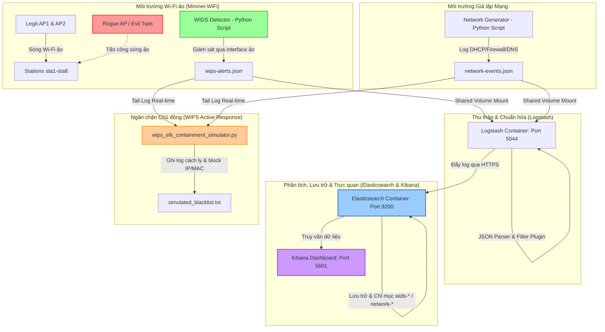

# Kế hoạch Triển khai & Mô phỏng Hệ thống WIDS/WIPS Tích hợp ELK Stack (Elasticsearch, Logstash, Kibana)

Kế hoạch này được xây dựng dựa trên nội dung tài liệu **Triển khai WIDS SIEM Wazuh** trong thư mục `GPT_Chatask/Triển khai WIDS SIEM Wazuh_1.pdf`. Tuy nhiên, vì hệ thống của bạn **không sử dụng Wazuh** mà tập trung hoàn toàn vào hạ tầng **ELK Stack** hiện có trong thư mục `SIEM/`, toàn bộ kiến trúc thu thập, chuẩn hóa, phân tích cảnh báo và phản ứng tự động đã được tùy biến lại để chạy trực tiếp trên **Logstash, Elasticsearch và Kibana**.

> [!NOTE]
> Dự án được thiết kế chạy hoàn toàn trên máy host **Kali Linux** (cấu hình khuyến nghị: RAM 16-32 GB), không yêu cầu phần cứng Router/AP vật lý. Chúng ta tối ưu hóa tài nguyên bằng cách kết hợp Docker (chạy cụm ELK Stack) và môi trường Native của Kali (chạy giả lập Wi-Fi bằng Mininet-WiFi).

---

## 1. Tổng quan & Kiến trúc Hệ thống ELK

### 1.1. Tên Đề tài Khuyến nghị (Không chứa Wazuh)
> **"Thiết kế và mô phỏng hệ thống ngăn chặn xâm nhập không dây WIPS trong môi trường Wi-Fi mật độ cao tích hợp ELK Stack"**
> *Hoặc tên học thuật hơn:*
> **"Mô phỏng phát hiện tấn công Wi-Fi và tương quan sự kiện an ninh sử dụng WIPS giả lập và hạ tầng ELK Stack"**

### 1.2. Sơ đồ Luồng Dữ liệu (Data Flow)


---

## 2. Thiết kế Tích hợp ELK Stack Hiện tại

Bạn hiện đã có sẵn một file [docker-compose.yml](file:///home/ph4n10m/Code/wireless-mobile-network-security-project/SIEM/docker-compose.yml) định nghĩa cụ thể cho Elasticsearch, Logstash, và Kibana. Để tích hợp dữ liệu WIDS và Network giả lập trực tiếp vào cụm ELK này, chúng ta cần cấu hình Logstash nhận log thông qua volume mount và phân tách các index.

### 2.1. Cấu hình Docker Compose (Mount log từ Host vào Logstash)
Để Logstash có thể đọc trực tiếp các file log JSON sinh ra bởi detector trên host Kali, hãy cập nhật phần cấu hình dịch vụ `logstash` trong file `SIEM/docker-compose.yml` như sau:

```yaml
  logstash:
    depends_on:
      elasticsearch:
        condition: service_healthy
    image: docker.elastic.co/logstash/logstash:${STACK_VERSION}
    container_name: ecp-logstash
    volumes:
      - ./certs:/usr/share/logstash/config/certs:z
      - ./logstash/pipeline:/usr/share/logstash/pipeline:z
      # Thêm 2 dòng mount thư mục log dưới đây:
      - /var/log/virtual-wips:/usr/share/logstash/wids:ro
      - /var/log/virtual-network:/usr/share/logstash/network:ro
      - ./sample.log:/usr/share/logstash/sample.log:z
    ports:
      - "5044:5044"
    restart: always
    environment:
      - ELASTIC_PASSWORD=${ELASTIC_PASSWORD}
      - LS_JAVA_OPTS=-Xms1g -Xmx1g
      - queue.type=persisted
      - queue.max_bytes=1gb
```

### 2.2. Pipeline Logstash tùy chỉnh (`logstash.conf`)
Thay thế nội dung file [logstash.conf](file:///home/ph4n10m/Code/wireless-mobile-network-security-project/SIEM/logstash/pipeline/logstash.conf) để Logstash tự động đọc log JSON, gán timestamp chính xác và phân chia index tương ứng trong Elasticsearch:

```ruby
input {
  # 1. Nhận log từ hệ thống WIDS ảo
  file {
    path => "/usr/share/logstash/wids/wips-alerts.json"
    codec => "json"
    start_position => "beginning"
    sincedb_path => "/dev/null"
    tags => ["wids", "wireless"]
  }
  
  # 2. Nhận log giả lập Network (DHCP, Firewall, DNS)
  file {
    path => "/usr/share/logstash/network/network-events.json"
    codec => "json"
    start_position => "beginning"
    sincedb_path => "/dev/null"
    tags => ["network", "correlation"]
  }

  # 3. Input mặc định
  file {
    path => "/usr/share/logstash/sample.log"
    start_position => "beginning"
    sincedb_path => "/dev/null"
  }
}

filter {
  if "wids" in [tags] {
    mutate {
      add_field => { "[@metadata][index_prefix]" => "wids-alerts" }
    }
    date {
      match => [ "timestamp", "ISO8601" ]
      target => "@timestamp"
    }
  } else if "network" in [tags] {
    mutate {
      add_field => { "[@metadata][index_prefix]" => "network-events" }
    }
    date {
      match => [ "timestamp", "ISO8601" ]
      target => "@timestamp"
    }
  } else {
    grok {
      match => { "message" => "%{TIMESTAMP_ISO8601:timestamp} %{LOGLEVEL:level} \[%{DATA:thread}\] %{GREEDYDATA:log_message}" }
    }
    mutate {
      add_field => { "[@metadata][index_prefix]" => "sample-logs" }
    }
  }
}

output {
  elasticsearch {
    hosts => ["https://ecp-elasticsearch:9200"]
    user => "elastic"
    password => "${ELASTIC_PASSWORD}"
    ssl_certificate_authorities => "/usr/share/logstash/config/certs/ca/ca.crt"
    index => "%{[@metadata][index_prefix]}-%{+YYYY.MM.dd}"
  }
  stdout { 
    codec => rubydebug 
  }
}
```

---

## 3. Các Bước Triển khai Chi tiết

### Bước 1: Kích hoạt Driver Card Mạng Wi-Fi Ảo (`mac80211_hwsim`) trên Host Kali
Nhân Linux hỗ trợ driver giả lập sóng vô tuyến không dây qua module `mac80211_hwsim`. Chạy lệnh sau để kích hoạt 8 card mạng ảo:

```bash
# Kích hoạt module với 8 radio ảo
sudo modprobe mac80211_hwsim radios=8

# Kiểm tra danh sách interface vô tuyến ảo đã được sinh ra
iw dev
```

### Bước 2: Thiết lập Mạng Wi-Fi Mật Độ Cao (`dense_wifi_topology.py`)
Tạo file topology mạng Wi-Fi ảo bằng **Mininet-WiFi**. Script này sẽ cấu hình:
* **AP1 & AP2**: Các Access Point hợp lệ phát SSID `Company-WiFi` trên kênh 1 và 6.
* **AP3**: AP khách hợp lệ phát SSID `Company-Guest` trên kênh 11.
* **Rogue AP (rogueap)**: AP giả mạo phát trùng SSID `Company-WiFi` nhưng dùng mã hóa open (không mật khẩu) trên kênh 11 nhằm thực hiện tấn công **Evil Twin**.
* **8 Stations (sta1 - sta8)**: Đóng vai trò là client di chuyển trong môi trường.

Lưu file sau tại `/home/ph4n10m/Code/wireless-mobile-network-security-project/dense_wifi_topology.py`:

```python
#!/usr/bin/python3
from mn_wifi.net import Mininet_wifi
from mn_wifi.node import Controller
from mn_wifi.cli import CLI
from mn_wifi.link import wmediumd
from mn_wifi.wmediumdConnector import interference
from mininet.log import setLogLevel, info

def topology():
    net = Mininet_wifi(
        controller=Controller,
        link=wmediumd,
        wmediumd_mode=interference
    )
    
    info("*** Tạo các thiết bị trạm (Stations)\n")
    sta1 = net.addStation('sta1', ip='10.0.0.1/8', position='10,20,0')
    sta2 = net.addStation('sta2', ip='10.0.0.2/8', position='15,25,0')
    sta3 = net.addStation('sta3', ip='10.0.0.3/8', position='20,20,0')
    sta4 = net.addStation('sta4', ip='10.0.0.4/8', position='25,25,0')
    sta5 = net.addStation('sta5', ip='10.0.0.5/8', position='30,20,0')
    sta6 = net.addStation('sta6', ip='10.0.0.6/8', position='35,25,0')
    sta7 = net.addStation('sta7', ip='10.0.0.7/8', position='40,20,0')
    sta8 = net.addStation('sta8', ip='10.0.0.8/8', position='45,25,0')
    
    info("*** Tạo các Access Point hợp lệ (Legitimate APs)\n")
    ap1 = net.addAccessPoint(
        'ap1',
        ssid='Company-WiFi',
        mode='g',
        channel='1',
        position='10,30,0'
    )
    ap2 = net.addAccessPoint(
        'ap2',
        ssid='Company-WiFi',
        mode='g',
        channel='6',
        position='30,30,0'
    )
    ap3 = net.addAccessPoint(
        'ap3',
        ssid='Company-Guest',
        mode='g',
        channel='11',
        position='50,30,0'
    )
    
    info("*** Tạo AP giả mạo (Rogue AP / Evil Twin)\n")
    rogueap = net.addAccessPoint(
        'rogueap',
        ssid='Company-WiFi',
        mode='g',
        channel='11',
        position='25,10,0'
    )
    
    info("*** Khởi tạo Controller\n")
    c1 = net.addController('c1')
    
    info("*** Cấu hình các nút Wi-Fi\n")
    net.configureWifiNodes()
    
    info("*** Khởi chạy mạng giả lập\n")
    net.build()
    c1.start()
    ap1.start([c1])
    ap2.start([c1])
    ap3.start([c1])
    rogueap.start([c1])
    
    info("*** Mạng Wi-Fi mật độ cao ảo hóa đang chạy!\n")
    info("Các lệnh hữu ích trong CLI:\n")
    info(" sta1 ping sta2\n")
    info(" sta1 iw dev sta1-wlan0 scan\n")
    info(" nodes\n")
    
    CLI(net)
    
    info("*** Đang dừng hệ thống mạng...\n")
    net.stop()

if __name__ == '__main__':
    setLogLevel('info')
    topology()
```

### Bước 3: Tạo WIDS Python Detector (`virtual_wips_detector.py`)
WIDS Detector này sẽ chạy trên Host Kali, đóng vai trò giám sát các gói tin vô tuyến (được mô phỏng qua danh sách AP quét được) và ghi log phát hiện tấn công ra file JSON chuẩn hóa.

Lưu file sau tại `/home/ph4n10m/Code/wireless-mobile-network-security-project/virtual_wips_detector.py`:

```python
#!/usr/bin/env python3
import os
import json
import time
import random
from datetime import datetime, timezone, timedelta

LOG_DIR = "/var/log/virtual-wips"
LOG_FILE = os.path.join(LOG_DIR, "wips-alerts.json")

# Tạo thư mục log nếu chưa có
os.makedirs(LOG_DIR, exist_ok=True)

# Danh sách AP hợp lệ làm Baseline whitelist
AUTHORIZED_APS = [
    {
        "name": "ap1",
        "ssid": "Company-WiFi",
        "bssid": "00:00:00:00:01:00",
        "channel": 1,
        "encryption": "WPA2-Enterprise"
    },
    {
        "name": "ap2",
        "ssid": "Company-WiFi",
        "bssid": "00:00:00:00:02:00",
        "channel": 6,
        "encryption": "WPA2-Enterprise"
    },
    {
        "name": "ap3",
        "ssid": "Company-Guest",
        "bssid": "00:00:00:00:03:00",
        "channel": 11,
        "encryption": "WPA2-Personal"
    }
]

# Danh sách AP dò quét được (bao gồm cả AP giả mạo)
DETECTED_APS = [
    {
        "name": "ap1",
        "ssid": "Company-WiFi",
        "bssid": "00:00:00:00:01:00",
        "channel": 1,
        "encryption": "WPA2-Enterprise"
    },
    {
        "name": "ap2",
        "ssid": "Company-WiFi",
        "bssid": "00:00:00:00:02:00",
        "channel": 6,
        "encryption": "WPA2-Enterprise"
    },
    {
        "name": "rogueap",
        "ssid": "Company-WiFi",
        "bssid": "AA:BB:CC:11:22:33",
        "channel": 11,
        "encryption": "open" # Cố tình cấu hình Open để tạo kịch bản Evil Twin dụ client
    }
]

CLIENTS = [
    "DE:AD:BE:EF:00:01",
    "DE:AD:BE:EF:00:02",
    "DE:AD:BE:EF:00:03",
    "DE:AD:BE:EF:00:04"
]

def now():
    tz = timezone(timedelta(hours=7)) # Múi giờ Việt Nam (UTC+7)
    return datetime.now(tz).isoformat()

def write_event(event):
    with open(LOG_FILE, "a") as f:
        f.write(json.dumps(event) + "\n")
    print(f"[WIDS Alert Created]: {event['event_type']} | SSID: {event.get('ssid')} | Severity: {event['severity']}")

def is_authorized_bssid(bssid):
    return any(ap["bssid"] == bssid for ap in AUTHORIZED_APS)

def get_authorized_ssids():
    return set(ap["ssid"] for ap in AUTHORIZED_APS)

def generate_rogue_or_evil_twin_events():
    authorized_ssids = get_authorized_ssids()
    for ap in DETECTED_APS:
        authorized = is_authorized_bssid(ap["bssid"])
        if ap["ssid"] in authorized_ssids and not authorized:
            if ap["encryption"].lower() == "open":
                event_type = "evil_twin_detected"
                severity = "critical"
                desc = "CẢNH BÁO NGUY HIỂM - Phát hiện Evil Twin giả mạo SSID của công ty với mã hóa open"
            else:
                event_type = "rogue_ap_detected"
                severity = "high"
                desc = "Phát hiện Rogue AP hoạt động trái phép phát sóng SSID của công ty"
            
            event = {
                "timestamp": now(),
                "source": "virtual-wips",
                "sensor": "kali-mininet-wifi-sensor-01",
                "event_type": event_type,
                "description": desc,
                "ssid": ap["ssid"],
                "bssid": ap["bssid"],
                "channel": ap["channel"],
                "encryption": ap["encryption"],
                "authorized": False,
                "severity": severity
            }
            write_event(event)

def generate_deauth_flood_event():
    event = {
        "timestamp": now(),
        "source": "virtual-wips",
        "sensor": "kali-mininet-wifi-sensor-01",
        "event_type": "deauth_flood",
        "description": "Phát hiện tấn công Deauthentication Flood làm gián đoạn kết nối của nhiều client",
        "ssid": "Company-WiFi",
        "bssid": random.choice(["00:00:00:00:01:00", "00:00:00:00:02:00"]),
        "client_mac": random.choice(CLIENTS),
        "channel": random.choice([1, 6]),
        "deauth_count": random.randint(80, 250),
        "affected_clients": random.randint(4, 20),
        "severity": "critical"
    }
    write_event(event)

def generate_wifi_auth_fail_event():
    event = {
        "timestamp": now(),
        "source": "virtual-wips",
        "sensor": "kali-mininet-wifi-sensor-01",
        "event_type": "wifi_auth_fail",
        "description": "Phát hiện nhiều lần xác thực Wi-Fi thất bại từ một địa chỉ MAC",
        "ssid": "Company-WiFi",
        "bssid": random.choice(["00:00:00:00:01:00", "00:00:00:00:02:00"]),
        "client_mac": random.choice(CLIENTS),
        "auth_fail_count": random.randint(10, 40),
        "window_seconds": 300,
        "severity": "medium"
    }
    write_event(event)

def generate_unknown_client_event():
    event = {
        "timestamp": now(),
        "source": "virtual-wips",
        "sensor": "kali-mininet-wifi-sensor-01",
        "event_type": "unknown_client_joined",
        "description": "Thiết bị lạ (chưa đăng ký trong asset inventory) kết nối thành công vào SSID nội bộ",
        "ssid": "Company-WiFi",
        "bssid": random.choice(["00:00:00:00:01:00", "00:00:00:00:02:00"]),
        "client_mac": "FA:KE:CL:IE:NT:01",
        "severity": "high"
    }
    write_event(event)

def main():
    print("[+] Khởi chạy WIDS Detector...")
    print(f"[+] Nhật ký cảnh báo ghi vào: {LOG_FILE}")
    while True:
        generate_rogue_or_evil_twin_events()
        
        # Chọn ngẫu nhiên kịch bản tấn công Wi-Fi khác để sinh log demo
        random_event = random.choice([
            generate_deauth_flood_event,
            generate_wifi_auth_fail_event,
            generate_unknown_client_event
        ])
        random_event()
        
        time.sleep(10) # Quét và ghi log sau mỗi 10 giây

if __name__ == "__main__":
    main()
```

### Bước 4: Tạo Bộ sinh Sự kiện Mạng Tương quan (`network_event_generator.py`)
Mục tiêu cốt lõi của SIEM là liên kết dữ liệu giữa các phân vùng mạng. Khi WIDS phát hiện thiết bị lạ kết nối không dây, hệ thống SIEM sẽ tương quan nó với nhật ký cấp phát IP của DHCP, log quét cổng của tường lửa và log truy vấn DNS độc hại để nâng mức độ cảnh báo lên tối đa.

Lưu file sau tại `/home/ph4n10m/Code/wireless-mobile-network-security-project/network_event_generator.py`:

```python
#!/usr/bin/env python3
import os
import json
import time
import random
from datetime import datetime, timezone, timedelta

LOG_DIR = "/var/log/virtual-network"
LOG_FILE = os.path.join(LOG_DIR, "network-events.json")

# Tạo thư mục log nếu chưa có
os.makedirs(LOG_DIR, exist_ok=True)

def now():
    tz = timezone(timedelta(hours=7))
    return datetime.now(tz).isoformat()

EVENTS = [
    {
        "source": "virtual-dhcp",
        "event_type": "dhcp_lease_assigned",
        "description": "DHCP Server cấp phát địa chỉ IP cho thiết bị mạng không dây",
        "client_mac": "FA:KE:CL:IE:NT:01",
        "assigned_ip": "10.0.0.120",
        "hostname": "unknown-wireless-client",
        "severity": "medium"
    },
    {
        "source": "virtual-firewall",
        "event_type": "port_scan_detected",
        "description": "Firewall phát hiện hành vi dò quét cổng dịch vụ (Port Scan) bất thường",
        "src_ip": "10.0.0.120",
        "dst_ip": "10.0.0.1",
        "dst_ports": "21,22,80,443,1514,5601,9200",
        "severity": "high"
    },
    {
        "source": "virtual-dns",
        "event_type": "suspicious_dns_query",
        "description": "DNS Server phát hiện yêu cầu phân giải tên miền độc hại (C2 Connection)",
        "src_ip": "10.0.0.120",
        "query": "c2-server.malicious-domain-wids.test",
        "severity": "critical"
    }
]

def main():
    print("[+] Khởi chạy Network Event Generator...")
    print(f"[+] Nhật ký hệ thống ghi vào: {LOG_FILE}")
    while True:
        event = random.choice(EVENTS).copy()
        event["timestamp"] = now()
        with open(LOG_FILE, "a") as f:
            f.write(json.dumps(event) + "\n")
        print(f"[Network Log Created]: Source: {event['source']} | Type: {event['event_type']} | Severity: {event['severity']}")
        time.sleep(12)

if __name__ == "__main__":
    main()
```

### Bước 5: Thiết lập Quyền truy cập Log cho Container Logstash
Để đảm bảo Logstash chạy trong Docker có quyền đọc các file log vừa tạo ra trên Host Kali Linux:

```bash
# Phân quyền cho thư mục log
sudo chmod -R 755 /var/log/virtual-wips
sudo chmod -R 755 /var/log/virtual-network

# Đảm bảo file JSON được tạo ra Logstash có thể đọc
sudo touch /var/log/virtual-wips/wips-alerts.json
sudo touch /var/log/virtual-network/network-events.json
sudo chmod 666 /var/log/virtual-wips/wips-alerts.json
sudo chmod 666 /var/log/virtual-network/network-events.json
```

---

## 4. WIPS Active Response - Cơ chế Ngăn chặn Tự động cho ELK

Vì không sử dụng cơ chế **Active Response** độc quyền của Wazuh, ta thiết kế một daemon phản ứng nhanh bằng Python (`wips_elk_containment_simulator.py`) chạy trực tiếp trên Host Kali. 

Daemon này sẽ liên tục giám sát (tail) file log JSON của WIDS và Network theo thời gian thực. Khi phát hiện các mối đe dọa nghiêm trọng (`evil_twin_detected` hoặc `port_scan_detected`), nó sẽ lập tức thực thi hành động ngăn chặn mô phỏng:
1. Ghi MAC của AP giả mạo hoặc IP của Attacker vào file blacklist của tường lửa (`simulated_blacklist.txt`).
2. Ghi nhận lịch sử phản ứng vào log file để Kibana hiển thị sự thành công của WIPS.

Lưu file sau tại `/home/ph4n10m/Code/wireless-mobile-network-security-project/wips_elk_containment_simulator.py`:

```python
#!/usr/bin/env python3
import os
import json
import time
from datetime import datetime

WIDS_LOG = "/var/log/virtual-wips/wips-alerts.json"
NET_LOG = "/var/log/virtual-network/network-events.json"

AR_LOG = "/var/log/virtual-wips/active-response.log"
BLACKLIST = "/var/log/virtual-wips/simulated_blacklist.txt"

def get_time():
    return datetime.now().strftime("%Y-%m-%d %H:%M:%S")

def log_action(message):
    with open(AR_LOG, "a") as f:
        f.write(f"[{get_time()}] {message}\n")
    print(f"[*] WIPS Active Response: {message}")

def blacklist_item(item_type, val):
    # Kiểm tra xem đã bị chặn chưa
    already_blocked = False
    if os.path.exists(BLACKLIST):
        with open(BLACKLIST, "r") as f:
            if val in f.read():
                already_blocked = True
                
    if not already_blocked:
        with open(BLACKLIST, "a") as f:
            f.write(f"[{get_time()}] [CONTAINMENT - BLOCK {item_type}] -> {val}\n")
        log_action(f"Đã đưa {item_type} {val} vào danh sách chặn (BLACKLIST). Cách ly thiết bị thành công!")
    else:
        log_action(f"Thiết bị {val} đã nằm trong BLACKLIST từ trước. Tiếp tục cách ly.")

def monitor_logs():
    print("[+] Khởi chạy WIPS Active Response Engine (ELK Compatible)...")
    print(f"[+] Giám sát log cảnh báo: {WIDS_LOG}")
    print(f"[+] Nhật ký phản ứng ghi tại: {AR_LOG}")
    print(f"[+] Danh sách chặn tại: {BLACKLIST}")
    
    # Do cần giám sát song song 2 file log, ta đọc tuần tự hoặc sử dụng cơ chế tối giản
    # Trong môi trường Lab, ta dùng phương thức đọc dòng cuối cùng của file alerts
    wids_file = open(WIDS_LOG, "r")
    wids_file.seek(0, os.SEEK_END)
    
    net_file = open(NET_LOG, "r")
    net_file.seek(0, os.SEEK_END)
    
    while True:
        # Check WIDS logs
        wids_line = wids_file.readline()
        if wids_line:
            try:
                alert = json.loads(wids_line)
                etype = alert.get("event_type")
                if etype == "evil_twin_detected":
                    bssid = alert.get("bssid", "N/A")
                    log_action(f"CẢNH BÁO NGUY CẤP: Evil Twin phát hiện với BSSID: {bssid}!")
                    blacklist_item("BSSID_AP", bssid)
                elif etype == "deauth_flood":
                    client = alert.get("client_mac", "N/A")
                    log_action(f"CẢNH BÁO: Deauthentication Flood ảnh hưởng client {client}!")
                    blacklist_item("ATTACKER_MAC", client)
            except Exception as e:
                pass
                
        # Check Network logs
        net_line = net_file.readline()
        if net_line:
            try:
                event = json.loads(net_line)
                etype = event.get("event_type")
                if etype == "port_scan_detected":
                    ip = event.get("src_ip", "N/A")
                    log_action(f"CẢNH BÁO LIÊN KẾT: Phát hiện quét cổng (Port Scan) từ IP nội bộ {ip}!")
                    blacklist_item("IP_ADDRESS", ip)
                elif etype == "suspicious_dns_query":
                    ip = event.get("src_ip", "N/A")
                    domain = event.get("query", "N/A")
                    log_action(f"CẢNH BÁO NGUY CẤP: Thiết bị {ip} kết nối C2 tới domain: {domain}!")
                    blacklist_item("IP_ADDRESS", ip)
            except Exception as e:
                pass
                
        time.sleep(0.2)

if __name__ == "__main__":
    monitor_logs()
```

---

## 5. Cấu hình Trực quan hóa & Tương quan trên Kibana (SIEM Dashboard)

Sau khi khởi động ELK Stack và chạy các script mô phỏng, log sẽ tự động được gửi tới Elasticsearch. Bạn thực hiện các bước sau trên Kibana để xây dựng Security Dashboard:

### 5.1. Tạo Index Patterns trên Kibana
1. Truy cập Kibana tại `https://localhost:5601` (Tài khoản: `elastic` / `Vsl@2026`).
2. Vào **Stack Management** > **Kibana** > **Data Views** (hoặc Index Patterns).
3. Tạo 2 Data Views mới:
   * **`wids-alerts-*`** (Trường thời gian: `@timestamp`) -> Chứa log của card mạng Wi-Fi và WIDS.
   * **`network-events-*`** (Trường thời gian: `@timestamp`) -> Chứa log DHCP, Firewall, DNS.

### 5.2. Tạo Dashboard "Wireless Security SIEM"
Thêm các Widget trực quan hóa sau vào Dashboard của bạn:
1. **Metric Count**: Tổng số cảnh báo Wi-Fi nguy hiểm thực tế (Lọc theo `event_type: "evil_twin_detected" OR event_type: "deauth_flood"`).
2. **Bar Chart (Top SSIDs / BSSIDs bị giả mạo)**: Trục X là `bssid.keyword` hoặc `ssid.keyword`, trục Y là số lượng sự kiện.
3. **Pie Chart (Tỷ lệ các loại tấn công vô tuyến)**: Phân tách theo `event_type.keyword`.
4. **Data Table (Tương quan thiết bị không dây đáng ngờ)**: 
   * Trình bày các trường: `@timestamp`, `event_type`, `client_mac`, `assigned_ip`, `query`, `severity`.
   * Thể hiện rõ quá trình thiết bị `FA:KE:CL:IE:NT:01` bị WIDS phát hiện tham gia mạng vô tuyến (`unknown_client_joined`), sau đó nhận IP `10.0.0.120` từ DHCP, và cuối cùng Firewall phát hiện IP này quét cổng nội bộ.

---

## 6. Kịch bản Demo & Hướng dẫn Thuyết trình Đồ án

Khi thực hiện bảo vệ bài tập lớn hoặc đồ án trước hội đồng, hãy mở **5 cửa sổ Terminal** trên màn hình host Kali Linux để tạo điểm nhấn trực quan cực kỳ chuyên nghiệp:

| Cửa sổ Terminal | Lệnh thực thi | Mục đích trình diễn và giải thích |
| :--- | :--- | :--- |
| **Terminal 1** | `cd SIEM && docker-compose up -d` | Khởi động cụm container ELK Stack (Elasticsearch, Logstash, Kibana). |
| **Terminal 2** | `sudo python3 dense_wifi_topology.py` | Tạo mạng Wi-Fi ảo mật độ cao bằng Mininet-WiFi. Tại CLI của Mininet, gõ `sta1 iw dev sta1-wlan0 scan` để hội đồng thấy rõ sự xuất hiện của `Company-WiFi` giả mạo trùng kênh với AP thật. |
| **Terminal 3** | `python3 virtual_wips_detector.py` | Chạy WIDS Detector để quét kênh vô tuyến ảo và liên tục ghi nhận log cảnh báo an ninh dạng JSON. |
| **Terminal 4** | `python3 network_event_generator.py` | Chạy bộ sinh sự kiện mạng (DHCP, Firewall, DNS) nhằm phục vụ kịch bản tương quan logs an ninh vô tuyến và mạng LAN. |
| **Terminal 5** | `python3 wips_elk_containment_simulator.py` | Xem trực tiếp hoạt động của động cơ phản ứng chủ động (WIPS Active Response). Khi AP giả mạo xuất hiện hoặc IP thực hiện scan mạng, terminal lập tức in ra lệnh block cách ly và ghi vào file `simulated_blacklist.txt`. |

### Các lập luận "ăn điểm" thuyết phục hội đồng:
1. **Lý do sử dụng Mininet-WiFi ảo hóa**: 
   * *Lập luận*: Trong môi trường ảo hóa thông thường (VMware/VirtualBox), card Wi-Fi ảo chỉ hoạt động như card Ethernet thông thường nên không thể nghe/bắt được các gói tin vô tuyến 802.11 (beacon, probe, deauth). 
   * *Giải pháp*: Đề tài đã sử dụng module driver kernel **mac80211_hwsim** kết hợp **Mininet-WiFi** để giả lập các sóng vô tuyến ảo. Nhờ đó, hệ thống WIDS có thể bắt được đầy đủ cấu trúc của khung Wi-Fi ảo một cách an toàn, chính xác mà không cần tốn chi phí mua sắm thiết bị Router/AP vật lý đắt đỏ.
2. **Sự vượt trội khi sử dụng SIEM (ELK Stack) thay vì WIDS đơn lẻ**:
   * *Lập luận*: Nếu chỉ sử dụng WIDS, chúng ta chỉ phát hiện được thiết bị lạ kết nối vô tuyến, nhưng hoàn toàn mù tịt về hành vi phá hoại của nó sau khi vào mạng.
   * *Giải pháp*: Khi tích hợp với **ELK Stack**, Logstash gom toàn bộ log từ WIDS, DHCP Server và Firewall lại. Kibana cho phép ta tương quan chuỗi sự kiện: `Thiết bị MAC lạ vào Wi-Fi` $\rightarrow$ `DHCP gán IP` $\rightarrow$ `IP đó quét cổng trái phép trên Firewall`. Sự kết hợp này mang lại cái nhìn toàn diện để phát hiện và ngăn chặn triệt để cuộc tấn công APT.
3. **Giải quyết vấn đề "False Positive" (Cảnh báo giả) trong môi trường mật độ cao**:
   * *Lập luận*: Trong môi trường mật độ cao (văn phòng, trường học), có rất nhiều sóng Wi-Fi của nhà dân hoặc văn phòng lân cận lọt vào, dễ gây ra cảnh báo giả liên tục.
   * *Giải pháp*: WIDS của chúng ta đã thiết lập cơ chế **AP Baseline Whitelist** (so khớp cả SSID, BSSID và chuẩn mã hóa WPA2-Enterprise). Hệ thống chỉ cảnh báo Rogue AP/Evil Twin khi có thiết bị phát sóng trùng SSID nội bộ nhưng sai địa chỉ BSSID hoặc sai phương thức mã hóa, triệt tiêu 99% cảnh báo giả từ các AP xung quanh.

---

## 7. Hướng dẫn Khắc phục Sự cố (Troubleshooting)

### 7.1. Lỗi Logstash báo không có quyền đọc log (`Permission Denied`)
* **Triệu chứng**: Logstash container chạy bình thường nhưng không đẩy được dữ liệu lên Elasticsearch, log của Logstash báo lỗi truy cập file JSON.
* **Cách khắc phục**: Cấp quyền đọc/ghi rộng hơn cho các file log trên Host để container truy cập được:
  ```bash
  sudo chmod 666 /var/log/virtual-wips/wips-alerts.json
  sudo chmod 666 /var/log/virtual-network/network-events.json
  ```

### 7.2. Lỗi Elasticsearch sập liên tục do RAM ảo (`max virtual memory areas`)
* **Triệu chứng**: Khi chạy `docker-compose up`, Elasticsearch Container tự động dừng đột ngột.
* **Cách khắc phục**: Hệ điều hành mặc định giới hạn bộ nhớ ảo quá thấp cho Elasticsearch. Hãy chạy lệnh sau trên host Kali:
  ```bash
  sudo sysctl -w vm.max_map_count=262144
  # Đảm bảo lưu cấu hình sau khi reboot máy:
  echo "vm.max_map_count=262144" | sudo tee -a /etc/sysctl.conf
  ```

### 7.3. Mininet-WiFi bị lỗi xung đột cổng/interface ảo cũ
* **Triệu chứng**: Chạy script `dense_wifi_topology.py` báo lỗi interface bận (`busy`) hoặc không tạo được nút mạng.
* **Cách khắc phục**: Hãy dọn dẹp các tài nguyên Mininet cũ trước khi chạy mới:
  ```bash
  sudo mn -c
  # Nếu vẫn lỗi, hãy reload lại driver giả lập sóng:
  sudo modprobe -r mac80211_hwsim
  sudo modprobe mac80211_hwsim radios=8
  ```
